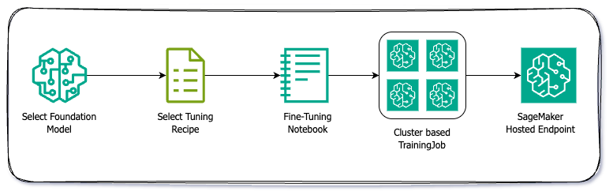
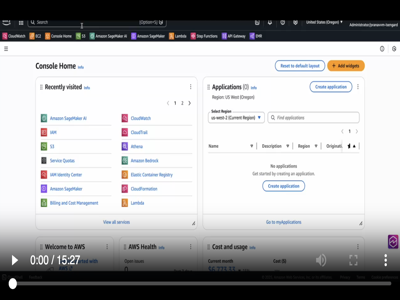
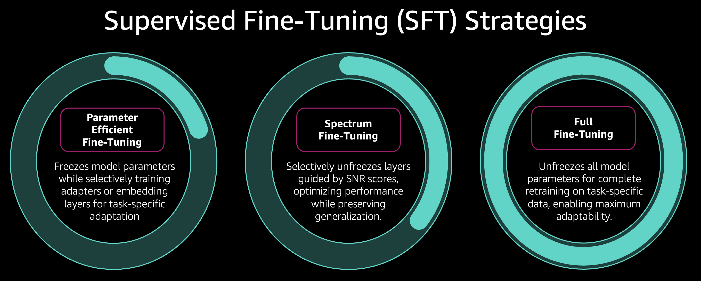
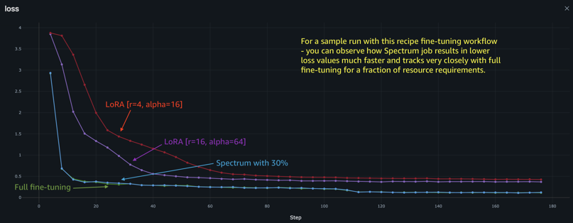
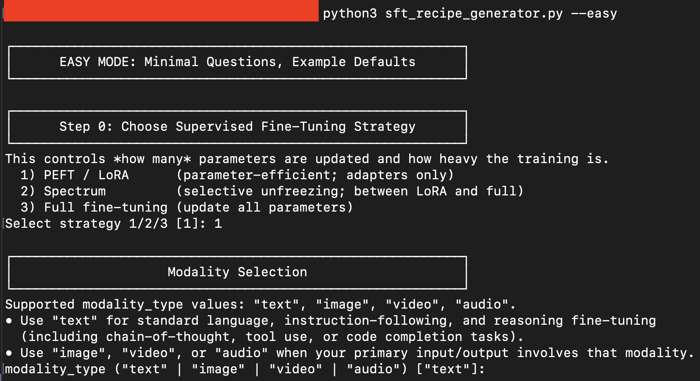

# Amazon SageMaker AI - OpenSource (OSS) Foundation Model Fine-tuning Recipes ⚙️

<!-- TOC -->

- [Amazon SageMaker AI - OpenSource OSS Foundation Model Fine-tuning Recipes ⚙️](#amazon-sagemaker-ai---opensource-oss-foundation-model-fine-tuning-recipes-)
    - [Overview](#overview)
    - [Key Features](#key-features)
    - [Model Customization on Amazon SageMaker AI](#model-customization-on-amazon-sagemaker-ai)
        - [Supervised Fine-Tuning SFT](#supervised-fine-tuning-sft)
            - [Quick Start](#quick-start)
            - [Quick Start: Demo Video](#quick-start-demo-video)
            - [Available Models and Recipes](#available-models-and-recipes)
            - [Quick Instance Reference Guide](#quick-instance-reference-guide)
            - [Supervised Fine-tuning strategy: Deep Dive](#supervised-fine-tuning-strategy-deep-dive)
            - [Comparing the Three SFT Approaches](#comparing-the-three-sft-approaches)
            - [Crafting your own - Fine-tuning OSS Recipe](#crafting-your-own---fine-tuning-oss-recipe)
                - [Automate Recipe Generation](#automate-recipe-generation)
                - [Hand-Crafted Recipe Generation](#hand-crafted-recipe-generation)
                - [Example: Minimal Template for a New Recipe](#example-minimal-template-for-a-new-recipe)
                - [Generating a Spectrum Configuration File](#generating-a-spectrum-configuration-file)
            - [Troubleshooting](#troubleshooting)
        - [WIP Preference Optimization](#wip-preference-optimization)
    - [Running Locally on an EC2/Self-Managed Instance](#running-locally-on-an-ec2self-managed-instance)
    - [License](#license)
    - [Support](#support)
    - [Contributing](#contributing)

<!-- /TOC -->


A comprehensive collection of OSS training recipes for fine-tuning foundation models on Amazon SageMaker AI using HuggingFace's open-source libraries. This repository provides production-ready configurations for various model families and training methodologies.

## Overview

This repository provides a comprehensive framework for model customization on Amazon SageMaker AI, supporting multiple training paradigms from supervised fine-tuning to preference optimization and pre-training. Built on HuggingFace's open-source ecosystem, it offers production-ready configurations for various model families and training methodologies.

## Key Features

- **🚀 One-Command Training Pipeline**: Single bash script orchestrates the entire workflow—from dependency installation and GPU discovery to distributed training, PEFT adapter merging, and optional evaluation. Just point to your YAML config and let the automation handle the rest.

- **🌐 Seamless Multi-Node & Multi-GPU Training**: Automatically detects SageMaker topology, configures distributed backends (DeepSpeed ZeRO-3, FSDP), and scales from single-GPU to multi-node clusters. Dynamic rendezvous backend selection ensures optimal performance whether running on 1 GPU or 100+.

- **🎯 Zero-Config Model & Data Handling**: Intelligent auto-detection of model architectures, tokenizers, and processors. Supports text, vision, and audio modalities out-of-the-box. Works with local JSONL files or HuggingFace datasets with automatic train/eval splitting.

- **⚡ Production-Ready Optimization Stack**: Built-in Flash Attention 2/3, Liger Kernel, gradient checkpointing, 4-bit quantization (BitsAndBytes/MXFP4), and mixed-precision training. Memory-efficient by default, with automatic batch size recommendations per instance type.

- **🔄 End-to-End Automation**: Post-training pipeline automatically merges PEFT adapters with base models, runs vLLM-powered batch inference, and executes comprehensive evaluation harnesses—all within the same training job. Deploy-ready models with zero manual intervention.

- **📊 EU AI Act Compliance (Experimental)**: Optional FLOPS (Floating Point Operations) calculation during training to support EU AI Act requirements. Enable with `compute_flops: true` in your recipe configuration to track computational resources used during model fine-tuning.

## Model Customization on Amazon SageMaker AI




### Supervised Fine-Tuning (SFT)

[Supervised Fine-Tuning (SFT)](https://docs.aws.amazon.com/sagemaker/latest/dg/nova-fine-tune.html) is the process of adapting pre-trained Large Language Models (LLMs) to specific tasks using labeled datasets. SFT combines the broad generalization abilities learned during large-scale pre-training with targeted supervision, allowing the model to exhibit domain-specific behaviors while retaining foundational knowledge. The training objective typically minimizes next-token cross-entropy over curated input–output pairs, enabling applications such as instruction following, domain adaptation, classification, summarization, and safety alignment.

SFT methods vary in how many parameters they update and how much representational change they can induce. Three major approaches—LoRA, Spectrum Training, and Full Fine-Tuning—span the efficiency/performance spectrum and offer practitioners different trade-offs depending on resource constraints and task complexity.


#### Quick Start

Get started with fine-tuning in 5 steps:

**Step 1: Choose Your Model and Training Strategy**

Browse the [Available Models and Recipes](#available-models-and-recipes) table and select:
- A model that fits your use case (text, vision, audio, or reasoning models)
- A training strategy based on your resources:
  - **QLoRA (PeFT)**: Most memory-efficient, fastest iteration, great for prototyping
  - **Spectrum**: Balanced approach, better performance than QLoRA
  - **Full Fine-tuning**: Maximum performance, requires more compute

Example: For a 3B parameter model, you might choose [Llama-3.2-3B-Instruct](supervised_finetuning/finetune--meta-llama--Llama-3.2-3B-Instruct.ipynb) with QLoRA strategy.

**Step 2: Prepare Your Dataset**

Your dataset must be in the `messages` format (conversational structure). You have two options:

Option A - Use your own dataset:
```json
{"messages": [{"role": "user", "content": "What is AI?"}, {"role": "assistant", "content": "AI stands for..."}]}
{"messages": [{"role": "user", "content": "Explain ML"}, {"role": "assistant", "content": "Machine Learning is..."}]}
```

Option B - Use public datasets for experimentation:
- HuggingFace datasets (e.g., `HuggingFaceH4/ultrachat_200k`)
- Pre-formatted instruction datasets

Save your dataset as a JSONL file or reference a HuggingFace dataset ID in your recipe configuration.

**Step 3: Launch Your Fine-tuning Job**

Open the notebook corresponding to your chosen model and configure the training job:

```python
# Configure training arguments
args = [
    "--config",
    "hf_recipes/meta-llama/Llama-3.2-3B-Instruct--vanilla-peft-qlora.yaml",
    # "--run-eval"  # Optional: Enable for end-to-end training + evaluation
]

# Set up source code and training script
source_code = SourceCode(
    source_dir="./sagemaker_code",
    command=f"bash sm_accelerate_train.sh {' '.join(args)}",
)

# Configure compute resources
compute_configs = Compute(
    instance_type="ml.g6e.2xlarge",      # See Instance Reference Guide below
    instance_count=1,                     # Use 2+ for multi-node training
    keep_alive_period_in_seconds=1800,   # Warm pool for faster iterations
    volume_size_in_gb=300
)

# Create and launch the training job
model_trainer = ModelTrainer(
    training_image=pytorch_image_uri,
    source_code=source_code,
    base_job_name=base_job_name,
    compute=compute_configs,
    stopping_condition=StoppingCondition(max_runtime_in_seconds=18000),
    output_data_config=OutputDataConfig(s3_output_path=output_path),
    checkpoint_config=CheckpointConfig(
        s3_uri=os.path.join(output_path, dataset_name, job_name, "checkpoints"),
        local_path="/opt/ml/checkpoints"
    ),
    role=role,
    environment=training_env
)

# Start training
model_trainer.fit()
```

Training modes:
- **Single-node**: Set `instance_count=1` for models up to 14B parameters
- **Multi-node**: Set `instance_count=2+` for larger models or faster training

**Step 4: (Optional) Run Evaluation**

Enable built-in evaluation by adding the `--run-eval` flag to your training arguments. This will:

1. Run vLLM-powered batch inference on your test dataset
2. Compute evaluation metrics automatically
3. Log results to MLflow for tracking

Available evaluation metrics:
- **Text similarity**: ROUGE-1, ROUGE-2, ROUGE-L, BLEU, BERTScore
- **LLM-as-Judge** (requires judge model): Answer similarity, correctness, relevance, faithfulness, toxicity

The evaluation runs within the same training job, producing deploy-ready models with quality metrics.

**Step 5: Deploy Your Fine-tuned Model**

Once training completes, deploy your model as a SageMaker endpoint using the [deployment notebook](supervised_finetuning/deploy-model-sagemaker-inference.ipynb):

```python
# The notebook will guide you through:
# 1. Extracting the fine-tuned model from S3
# 2. Creating an endpoint configuration with vLLM
# 3. Deploying the model for real-time inference
# 4. Testing your deployed endpoint

# Example inference call
response = sagemaker_runtime.invoke_endpoint(
    EndpointName=endpoint_name,
    ContentType="application/json",
    Body=json.dumps({
        'messages': [{"role": "user", "content": "Your prompt here"}],
        'temperature': 0.7,
        'max_tokens': 512
    })
)
```

#### Quick Start: Demo Video

Watch this demo video 👇🏼

[](https://aws-ml-blog.s3.us-east-1.amazonaws.com/artifacts/genai-builder-workshop/sagemaker/Model-Customization-OSS-Recipes-Fine-Tuning-Demo.mp4)


**Quick Reference: Training Time Estimates**

| Model Size | Strategy | Instance Type | Approx. Time (1 epoch, 10K samples) |
|------------|----------|---------------|-------------------------------------|
| 1-4B | QLoRA | ml.g5.2xlarge | 2-4 hours |
| 7-14B | QLoRA | ml.g6e.2xlarge | 4-8 hours |
| 17-32B | QLoRA | ml.p4de.24xlarge | 6-12 hours |
| 70B+ | QLoRA | ml.p5e.48xlarge | 12-24 hours |

**Need Help?** Check the [Troubleshooting](#troubleshooting) section or [Instance Reference Guide](#quick-instance-reference-guide) below.


#### Available Models and Recipes


| Model | Modality | Reasoning | QLoRA | Spectrum | Full | Notebook | Notes |
|-------|----------|-----------|-------|----------|------|----------|-------|
| | | | | | | | |
| **🦙 Meta (Llama)** | | | | | | | |
| meta-llama/Llama-3.2-3B-Instruct | Text to Text | No | ✅ [QLoRA](supervised_finetuning/sagemaker_code/hf_recipes/meta-llama/Llama-3.2-3B-Instruct--vanilla-peft-qlora.yaml) | ✅ [Spectrum](supervised_finetuning/sagemaker_code/hf_recipes/meta-llama/Llama-3.2-3B-Instruct--vanilla-spectrum.yaml) | ✅ [Full](supervised_finetuning/sagemaker_code/hf_recipes/meta-llama/Llama-3.2-3B-Instruct--vanilla-full.yaml) | 📓 [Notebook](supervised_finetuning/finetune--meta-llama--Llama-3.2-3B-Instruct.ipynb) | Flash Attention 2, compact model |
| meta-llama/Llama-3.3-70B-Instruct | Text to Text | No | ✅ [QLoRA](supervised_finetuning/sagemaker_code/hf_recipes/meta-llama/Llama-3.3-70B-Instruct--vanilla-peft-qlora.yaml) | ✅ [Spectrum](supervised_finetuning/sagemaker_code/hf_recipes/meta-llama/Llama-3.3-70B-Instruct--vanilla-spectrum.yaml) | ✅ [Full](supervised_finetuning/sagemaker_code/hf_recipes/meta-llama/Llama-3.3-70B-Instruct--vanilla-full.yaml) | 📓 [Notebook](supervised_finetuning/finetune--meta-llama--Llama-3.3-70B-Instruct.ipynb) | Large scale model, enhanced capabilities |
| meta-llama/Llama-3.2-11B-Vision-Instruct | Image, Text to Text | No | ✅ [QLoRA](supervised_finetuning/sagemaker_code/hf_recipes/meta-llama/Llama-3.2-11B-Vision-Instruct--vanilla-peft-qlora.yaml) | ✅ [Spectrum](supervised_finetuning/sagemaker_code/hf_recipes/meta-llama/Llama-3.2-11B-Vision-Instruct--vanilla-spectrum.yaml) | ✅ [Full](supervised_finetuning/sagemaker_code/hf_recipes/meta-llama/Llama-3.2-11B-Vision-Instruct--vanilla-full.yaml) | 📓 [Notebook](supervised_finetuning/finetune--meta-llama--Llama-3.2-11B-Vision-Instruct.ipynb) | Vision-language model |
| meta-llama/Llama-4-Maverick-17B-128E-Instruct | Image, Text to Text | No | ✅ [QLoRA](supervised_finetuning/sagemaker_code/hf_recipes/meta-llama/Llama-4-Maverick-17B-128E-Instruct--vanilla-peft-qlora.yaml) | ✅ [Spectrum](supervised_finetuning/sagemaker_code/hf_recipes/meta-llama/Llama-4-Maverick-17B-128E-Instruct--vanilla-spectrum.yaml) | ✅ [Full](supervised_finetuning/sagemaker_code/hf_recipes/meta-llama/Llama-4-Maverick-17B-128E-Instruct--vanilla-full.yaml) | 📓 [Notebook](supervised_finetuning/finetune--meta-llama--Llama-4-Maverick-17B-128E-Instruct.ipynb) | MoE vision-language model, 128 experts |
| | | | | | | | |
| **🤖 OpenAI** | | | | | | | |
| openai/gpt-oss-20b | Text to Text | Yes | ✅ [QLoRA](supervised_finetuning/sagemaker_code/hf_recipes/openai/gpt-oss-20b--vanilla-peft-qlora.yaml) | ✅ [Spectrum](supervised_finetuning/sagemaker_code/hf_recipes/openai/gpt-oss-20b--vanilla-spectrum.yaml) | ✅ [Full](supervised_finetuning/sagemaker_code/hf_recipes/openai/gpt-oss-20b--vanilla-full.yaml) | 📓 [Notebook](supervised_finetuning/finetune--openai--gpt-oss-20b.ipynb) | 4-bit quantization, optimized for efficiency |
| openai/gpt-oss-120b | Text to Text | Yes | ✅ [QLoRA](supervised_finetuning/sagemaker_code/hf_recipes/openai/gpt-oss-120b--vanilla-peft-qlora.yaml) | ✅ [Spectrum](supervised_finetuning/sagemaker_code/hf_recipes/openai/gpt-oss-120b--vanilla-spectrum.yaml) | ✅ [Full](supervised_finetuning/sagemaker_code/hf_recipes/openai/gpt-oss-120b--vanilla-full.yaml) | 📓 [Notebook](supervised_finetuning/finetune--openai--gpt-oss-120b.ipynb) | Large scale model, 4-bit quantization |
| | | | | | | | |
| **🔮 Qwen (Alibaba)** | | | | | | | |
| Qwen/Qwen2.5-3B-Instruct | Text to Text | No | ✅ [QLoRA](supervised_finetuning/sagemaker_code/hf_recipes/Qwen/Qwen2.5-3B-Instruct--vanilla-peft-qlora.yaml) | ✅ [Spectrum](supervised_finetuning/sagemaker_code/hf_recipes/Qwen/Qwen2.5-3B-Instruct--vanilla-spectrum.yaml) | ✅ [Full](supervised_finetuning/sagemaker_code/hf_recipes/Qwen/Qwen2.5-3B-Instruct--vanilla-full.yaml) | 📓 [Notebook](supervised_finetuning/finetune--Qwen--Qwen2.5-3B-Instruct.ipynb) | Compact, efficient model |
| Qwen/QwQ-32B | Text to Text | Yes | ✅ [QLoRA](supervised_finetuning/sagemaker_code/hf_recipes/Qwen/QwQ-32B--vanilla-peft-qlora.yaml) | ✅ [Spectrum](supervised_finetuning/sagemaker_code/hf_recipes/Qwen/QwQ-32B--vanilla-spectrum.yaml) | ✅ [Full](supervised_finetuning/sagemaker_code/hf_recipes/Qwen/QwQ-32B--vanilla-full.yaml) | 📓 [Notebook](supervised_finetuning/finetune--Qwen--QwQ-32B.ipynb) | Reasoning-focused model |
| Qwen/Qwen2-Audio-7B-Instruct | Audio, Text to Text | No | ✅ [QLoRA](supervised_finetuning/sagemaker_code/hf_recipes/Qwen/Qwen2-Audio-7B-Instruct-vanilla-peft-qlora.yaml) | - | ✅ [Full](supervised_finetuning/sagemaker_code/hf_recipes/Qwen/Qwen2-Audio-7B-Instruct-vanilla-full.yaml) | 📓 [Notebook](supervised_finetuning/finetune--Qwen--Qwen2-Audio-7B-Instruct.ipynb) | Audio-language model |
| Qwen/Qwen3-VL-2B-Instruct | Image, Text to Text | No | ✅ [QLoRA](supervised_finetuning/sagemaker_code/hf_recipes/Qwen/Qwen3-VL-2B-Instruct-vanilla-peft-qlora.yaml) | - | ✅ [Full](supervised_finetuning/sagemaker_code/hf_recipes/Qwen/Qwen3-VL-2B-Instruct-vanilla-full.yaml) | 📓 [Notebook](supervised_finetuning/finetune--Qwen--Qwen3-VL-2B-Instruct.ipynb) | Compact vision-language model |
| Qwen/Qwen3-VL-4B-Instruct | Image, Text to Text | No | ✅ [QLoRA](supervised_finetuning/sagemaker_code/hf_recipes/Qwen/Qwen3-VL-4B-Instruct-vanilla-peft-qlora.yaml) | - | ✅ [Full](supervised_finetuning/sagemaker_code/hf_recipes/Qwen/Qwen3-VL-4B-Instruct-vanilla-full.yaml) | 📓 [Notebook](supervised_finetuning/finetune--Qwen--Qwen3-VL-4B-Instruct.ipynb) | Vision-language model with enhanced capabilities |
| | | | | | | | |
| **🧠 DeepSeek** | | | | | | | |
| deepseek-ai/DeepSeek-R1-0528 | Text to Text | Yes | ✅ [QLoRA](supervised_finetuning/sagemaker_code/hf_recipes/deepseek-ai/DeepSeek-R1-0528--vanilla-peft-qlora.yaml) | ✅ [Spectrum](supervised_finetuning/sagemaker_code/hf_recipes/deepseek-ai/DeepSeek-R1-0528--vanilla-spectrum.yaml) | ✅ [Full](supervised_finetuning/sagemaker_code/hf_recipes/deepseek-ai/DeepSeek-R1-0528--vanilla-full.yaml) | 📓 [Notebook](supervised_finetuning/finetune--deepseek-ai--DeepSeek-R1-0528.ipynb) | Advanced reasoning model |
| deepseek-ai/DeepSeek-R1-Distill-Qwen-1.5B | Text to Text | Yes | ✅ [QLoRA](supervised_finetuning/sagemaker_code/hf_recipes/deepseek-ai/DeepSeek-R1-Distill-Qwen-1.5B--vanilla-peft-qlora.yaml) | ✅ [Spectrum](supervised_finetuning/sagemaker_code/hf_recipes/deepseek-ai/DeepSeek-R1-Distill-Qwen-1.5B--vanilla-spectrum.yaml) | ✅ [Full](supervised_finetuning/sagemaker_code/hf_recipes/deepseek-ai/DeepSeek-R1-Distill-Qwen-1.5B--vanilla-full.yaml) | 📓 [Notebook](supervised_finetuning/finetune--deepseek-ai--DeepSeek-R1-Distill-Qwen-1.5B.ipynb) | Compact reasoning model, distilled from R1 |
| | | | | | | | |
| **🔬 Microsoft** | | | | | | | |
| microsoft/Phi-3-mini-128k-instruct | Text to Text | No | ✅ [QLoRA](supervised_finetuning/sagemaker_code/hf_recipes/microsoft/Phi-3-mini-128k-instruct--vanilla-peft-qlora.yaml) | ✅ [Spectrum](supervised_finetuning/sagemaker_code/hf_recipes/microsoft/Phi-3-mini-128k-instruct--vanilla-spectrum.yaml) | ✅ [Full](supervised_finetuning/sagemaker_code/hf_recipes/microsoft/Phi-3-mini-128k-instruct--vanilla-full.yaml) | 📓 [Notebook](supervised_finetuning/finetune--microsoft--Phi-3-mini-128k-instruct.ipynb) | Compact model, 128K context window |
| microsoft/phi-4 | Text to Text | No | ✅ [QLoRA](supervised_finetuning/sagemaker_code/hf_recipes/microsoft/phi-4--vanilla-peft-qlora.yaml) | ✅ [Spectrum](supervised_finetuning/sagemaker_code/hf_recipes/microsoft/phi-4--vanilla-spectrum.yaml) | ✅ [Full](supervised_finetuning/sagemaker_code/hf_recipes/microsoft/phi-4--vanilla-full.yaml) | 📓 [Notebook](supervised_finetuning/finetune--microsoft--phi-4.ipynb) | Advanced reasoning and coding capabilities |
| | | | | | | | |
| **🌟 Google** | | | | | | | |
| google/gemma-3-4b-it | Image, Text to Text | No | ✅ [QLoRA](supervised_finetuning/sagemaker_code/hf_recipes/google/gemma-3-4b-it--vanilla-peft-qlora.yaml) | - | ✅ [Full](supervised_finetuning/sagemaker_code/hf_recipes/google/gemma-3-4b-it--vanilla-full.yaml) | 📓 [Notebook](supervised_finetuning/finetune--google--gemma-3-4b-it.ipynb) | Efficient 4B model |
| google/gemma-3-27b-it | Image, Text to Text | No | ✅ [QLoRA](supervised_finetuning/sagemaker_code/hf_recipes/google/gemma-3-27b-it--vanilla-peft-qlora.yaml) | - | ✅ [Full](supervised_finetuning/sagemaker_code/hf_recipes/google/gemma-3-27b-it--vanilla-full.yaml) | 📓 [Notebook](supervised_finetuning/finetune--google--gemma-3-27b-it.ipynb) | Latest Gemma model, instruction-tuned |

#### Quick Instance Reference Guide

**By Model Size (PeFT/QLoRA Training)**

```
1-4B Parameters    →  ml.g5.2xlarge      (1x A10G, 24GB)
4-14B Parameters   →  ml.g6e.2xlarge     (1x L40S, 48GB)
17-27B Parameters  →  ml.p4de.24xlarge   (8x A100, 320GB)
32-70B Parameters  →  ml.p4de.24xlarge   (8x A100, 320GB)
120B Parameters    →  ml.p5e.48xlarge    (8x H100, 640GB)
600B+ Parameters   →  ml.p5en.48xlarge   (8x H200, 1120GB)
```

**By Training Strategy: PeFT (QLoRA) - Most Memory Efficient**
```
Small (1-4B)    →  ml.g5.2xlarge
Medium (7-14B)  →  ml.g6e.2xlarge
Large (17-32B)  →  ml.p4de.24xlarge
XL (70-120B)    →  ml.p5e.48xlarge
XXL (600B+)     →  ml.p5en.48xlarge
```

**By Training Strategy: Spectrum - Balanced Approach**
```
Small (1-4B)    →  ml.g6e.2xlarge
Medium (7-14B)  →  ml.g6e.2xlarge or ml.g6e.4xlarge
Large (17-32B)  →  ml.p4de.24xlarge
XL (70-120B)    →  ml.p5e.48xlarge
XXL (600B+)     →  ml.p5en.48xlarge
```

**By Training Strategy: Full Fine-tuning - Maximum Performance**
```
Small (1-4B)    →  ml.g6e.2xlarge
Medium (7-14B)  →  ml.g6e.2xlarge or ml.g6e.12xlarge
Large (17-32B)  →  ml.p4de.24xlarge or ml.p5e.48xlarge
XL (70-120B)    →  ml.p5e.48xlarge
XXL (600B+)     →  ml.p5en.48xlarge
```

**Instance Type Specs**

| Instance | GPUs | GPU Type | VRAM/GPU | Total VRAM | Use Case |
|----------|------|----------|----------|------------|----------|
| ml.g5.2xlarge | 1 | A10G | 24GB | 24GB | Small models, dev/test |
| ml.g6e.2xlarge | 1 | L40S | 48GB | 48GB | Small-medium models |
| ml.g6e.4xlarge | 1 | L40S | 48GB | 48GB | Medium models, higher compute |
| ml.g6e.12xlarge | 4 | L40S | 48GB | 192GB | Large models, multi-GPU |
| ml.p4de.24xlarge | 8 | A100 | 40GB | 320GB | Large models, production |
| ml.p5e.48xlarge | 8 | H100 | 80GB | 640GB | XL models, latest gen |
| ml.p5en.48xlarge | 8 | H200 | 140GB | 1120GB | XXL models, max capacity |

**Decision Tree**

```
Start Here
    ↓
Is your model < 4B parameters?
    YES → Use ml.g5.2xlarge (PeFT)
    NO  → Continue
    ↓
Is your model 4-14B parameters?
    YES → Use ml.g6e.2xlarge (PeFT/Spectrum)
    NO  → Continue
    ↓
Is your model 17-32B parameters?
    YES → Use ml.p4de.24xlarge (PeFT/Spectrum)
    NO  → Continue
    ↓
Is your model 32-120B parameters?
    YES → Use ml.p5e.48xlarge (PeFT/Full)
    NO  → Continue
    ↓
Is your model 600B+ parameters?
    YES → Use ml.p5en.48xlarge (PeFT/Spectrum/Full)
```

Pro Tips:

1. **Always start with PeFT on the smallest recommended instance**
2. **Use Spot instances** to save 50-70% on costs
3. **Enable warm pools** (`keep_alive_period_in_seconds=1800`) for iterative training
4. **Multimodal models** need one tier higher than text-only models
5. **Full fine-tuning** typically needs 2-4x more memory than PeFT
6. **Batch size** can be adjusted to fit available memory (see main guide)


#### Supervised Fine-tuning strategy: Deep Dive




| Method                      | Parameter Efficiency (GPU / Memory) | Capacity / Task Specialization | Typical Profile                               |
| --------------------------- | ----------------------------------- | ------------------------------ | --------------------------------------------- |
| **LoRA (Adapters)**         | ★★★★★                               | ★★☆☆☆                          | Ultra-efficient, great for rapid iteration    |
| **Spectrum (Selective FT)** | ★★★☆☆                               | ★★★★☆                          | Balanced cost vs. accuracy, targeted layers   |
| **Full Fine-Tuning**        | ★★☆☆☆                               | ★★★★★                          | Maximum specialization, highest resource cost |

```
                              SUPERVISED FINE-TUNING DESIGN SPACE

        ┌──────────────────────────── LoRA (Low-Rank Adaptation) ────────────────────────────┐
        │ Core idea:                                                                         │
        │   • Insert small low-rank matrices into selected layers; keep base weights frozen. │
        │   • Assumes useful updates live in a low-dimensional subspace.                     │
        │                                                                                    │
        │ Practical profile:                                                                 │
        │   • Parameter-efficient, low memory, runs on smaller GPUs.                         │
        │   • Fast iteration; easy to train many adapters on one base model.                 │
        │                                                                                    │
        │ Best for:                                                                          │
        │   • Instruction-following and lightweight domain adaptation.                       │
        │   • Rapid prototyping, constrained environments, multi-tenant adapter setups.      │
        └────────────────────────────────────────────────────────────────────────────────────┘


        ┌──────────────────── Spectrum Training (Selective Parameter Fine-Tuning) ───────────────────┐
        │ Core idea:                                                                                 │
        │   • Unfreeze only chosen submodules (attention, MLPs, norms, embeddings, etc.).            │
        │   • Targets “anatomically” relevant components for the task.                               │
        │                                                                                            │
        │ Practical profile:                                                                         │
        │   • More capacity than LoRA (more weights can move).                                       │
        │   • Cheaper than full FT (only a subset of parameters is updated).                         │
        │   • Highly configurable: good for ablations and controlled adaptation strategies.          │
        │                                                                                            │
        │ Best for:                                                                                  │
        │   • Cases where LoRA underperforms but full FT is overkill.                                │
        │   • Moderate domain shift and tasks needing deeper specialization of specific layers.      │
        └────────────────────────────────────────────────────────────────────────────────────────────┘


        ┌──────────────────────── Full Fine-Tuning (End-to-End) ────────────────────────────┐
        │ Core idea:                                                                        │
        │   • Update all model parameters; the entire network can realign to the new data.  │
        │   • Enables large representational and behavioral shifts.                         │
        │                                                                                   │
        │ Practical profile:                                                                │
        │   • Highest performance ceiling, especially for heavy domain shifts.              │
        │   • Most expensive: requires substantial GPU memory and training time.            │
        │                                                                                   │
        │ Best for:                                                                         │
        │   • Specialized domains (biomedical, legal, scientific, financial, etc.).         │
        │   • Complex reasoning workloads where maximum accuracy is critical.               │
        │   • Setups with ample compute budget and strong reliability requirements.         │
        └───────────────────────────────────────────────────────────────────────────────────┘
```

#### Comparing the Three SFT Approaches

> [!TIP]
> Below image shows a **sample** run that highlights the differences between the 3 techniques on loss curves
> 

| Method | Trainable Parameters | Compute Cost | Adaptation Depth | Strengths |
|--------|----------------------|--------------|------------------|-----------|
| **LoRA** | Very Low | Very Low | Moderate | Adapter-based flexibility, fast training, minimal memory |
| **Spectrum** | Medium (Configurable) | Medium | High | Balanced efficiency, selective adaptation, tunable complexity |
| **Full Fine-Tuning** | All Parameters | High | Maximum | Best performance for large domain shifts or highly specialized tasks |


Supervised Fine-Tuning provides a principled way to specialize LLMs to new tasks while leveraging the power of pre-training. LoRA enables efficient and scalable customization, Spectrum Training offers a flexible mid-point with stronger adaptation capacity, and Full Fine-Tuning delivers maximal expressiveness for domains requiring deep model transformation. The optimal choice depends on compute availability, domain shift, and the performance requirements of the downstream application.


#### Crafting your own - Fine-tuning OSS Recipe

##### Automate Recipe Generation
> [!TIP]
> It is strongly recommended to use the [`sft_recipe_generator.py`](./supervised_finetuning/sft_recipe_generator.py) script to create your custom SFT recipes.
>
> To quickly generate a test recipe for a PEFT / Spectrum / Full fine-tuning strategy, run:
>
> ```bash
> python3 sft_recipe_generator.py --easy
> ```
>
> To walk through a more detailed, step-by-step workflow and fully customize your PEFT / Spectrum / Full fine-tuning recipe, run:
>
> ```bash
> python3 sft_recipe_generator.py
> ```




##### Hand-Crafted Recipe Generation

Fine-tuning recipes in this framework follow a consistent YAML structure that cleanly separates model configuration, dataset parameters, adaptation method (LoRA, Spectrum, or Full), training hyperparameters, and logging settings. Understanding this structure makes it straightforward to author new recipes or modify existing ones to fit your model, dataset, or training environment.

A recipe acts as a **single source of truth** for all fine-tuning decisions—model architecture, precision, target modules, optimization strategy, scheduling, and experiment tracking. Each block is declarative, making it easy to version, store in Git, share within teams, or auto-load into training scripts.

Here's an example of a recipe for fine-tuning a model with LoRA:

##### Example: Minimal Template for a New Recipe

```yaml
# Model arguments
model_name_or_path: <model-path>
tokenizer_name_or_path: <tokenizer-path>
torch_dtype: bfloat16
output_dir: <output-directory>

# Dataset arguments
dataset_id_or_path: <dataset-path>
max_seq_length: 4096
packing: false

# Adaptation method (choose one)
use_peft: true                # For LoRA (set to false for full FT)
load_in_4bit: true.           # Set to true/false to load and enable 4-bit quant
lora_target_modules: "all-linear"
lora_r: 8
lora_alpha: 16

# or Spectrum
# spectrum_config_path: configs/spectrum/<your-config>.yaml

# Training arguments
num_train_epochs: 1
per_device_train_batch_size: 2
gradient_accumulation_steps: 2
learning_rate: 1e-4
lr_scheduler_type: cosine

# Logging arguments
report_to:
- mlflow
- tensorboard
run_name: <experiment-name>
save_strategy: epoch
seed: 42
```

Or just modify an existing recipe with your choice of model and dataset
1. [PeFT](supervised_finetuning/sagemaker_code/hf_recipes/deepseek-ai/DeepSeek-R1-Distill-Qwen-1.5B--vanilla-peft-qlora.yaml)
2. [Spectrum](supervised_finetuning/sagemaker_code/hf_recipes/deepseek-ai/DeepSeek-R1-Distill-Qwen-1.5B--vanilla-spectrum.yaml)
3. [Full fine-tuning](supervised_finetuning/sagemaker_code/hf_recipes/deepseek-ai/DeepSeek-R1-Distill-Qwen-1.5B--vanilla-full.yaml)

Below is a breakdown of the core sections and how they should be customized.


                            ┌───────────────────────────┐
                            │   Start With a Template   │
                            │  (LoRA / Spectrum / Full) │
                            └─────────────┬─────────────┘
                                          │
                                          ▼
                            ┌───────────────────────────┐
                            │   Update Model Section    │
                            │ - model path              │
                            │ - tokenizer path          │
                            │ - dtype / precision       │
                            │ - output directory        │
                            └─────────────┬─────────────┘
                                          │
                                          ▼
                            ┌────────────────────────────┐
                            │     Configure Dataset      │
                            │ - dataset path             │
                            │ - seq length               │
                            │ - packing setting          │
                            └─────────────┬──────────────┘
                                          │
                                          ▼
            ┌──────────────────────────────────────────────────────────┐
            │                 Choose Adaptation Method                 │
            │──────────────────────────────────────────────────────────│
            │   LoRA:     use_peft: true, r/alpha, target modules      │
            │   Spectrum: spectrum_config_path: <yaml>                 │
            │   Full FT:  update all params, no adapters               │
            └───────────────────────────────┬──────────────────────────┘
                                            │
                                            ▼
                            ┌────────────────────────────┐
                            │     Set Training Params    │
                            │ - epochs                   │
                            │ - batch size               │
                            │ - grad accumulation        │
                            │ - lr + scheduler           │
                            │ - checkpointing            │
                            └─────────────┬──────────────┘
                                          │
                                          ▼
                            ┌────────────────────────────┐
                            │      Configure Logging     │
                            │ - MLflow / Tboard / etc    │
                            │ - run name                 │
                            │ - save strategy            │
                            │ - seed                     │
                            └─────────────┬──────────────┘
                                          │
                                          ▼
            ┌──────────────────────────────────────────────────────────┐
            │         Validate YAML Structure & Paths                  │
            │ - indentation                                            │
            │ - local/remote paths                                     │
            │ - config loads without error                             │
            └─────────────────────────────┬────────────────────────────┘
                                          │
                                          ▼
            ┌──────────────────────────────────────────────────────────┐
            │         Run a Dry-Run Using --config                     │
            │     (Validate before large-scale training)               │
            └──────────────────────────────────────────────────────────┘


See Appendix for detailed information on parameters and descriptions.

##### FLOPS Calculation for EU AI Act Compliance (Experimental)

The framework includes optional FLOPS (Floating Point Operations) measurement capabilities to support EU AI Act transparency and documentation requirements. This feature tracks computational resources used during fine-tuning.

**Enabling FLOPS Calculation:**

Add the following to your recipe YAML file:

```yaml
# EU AI Act Compliance (Optional)
compute_flops: true
```

**Environment Variables:**

- `PRETRAIN_FLOPS`: (Optional) Pretraining FLOPS value for comparison threshold calculations
- `FLOPS_METER_NVML`: Set to "1" (default) to enable hardware-based FLOPS sampling via NVML
- `FLOPS_METER_OUT`: Custom output path for FLOPS metrics JSON file

**Output:**

When enabled, the training job generates a `flops_meter.json` file containing:
- Architectural FLOPS (analytical calculation based on model operations)
- Hardware FLOPS (measured from GPU utilization)
- Token processing statistics
- Training duration and resource utilization
- Comparison against pretraining thresholds (if provided)

**Example Output:**

```json
{
  "Flops_architecture": "1.45e+13",
  "Flops_hardware": "1.52e+15",
  "Flops_original": "8.70e+22",
  "N_total": 1585294704,
  "N_trainable": 680094720,
  "threshold_type": "default_3.3e22",
  "threshold_value": "3.30e+22",
  "tokens_processed": 2150,
}
```

**Example Recipe Configuration:**

```yaml
model_name_or_path: meta-llama/Llama-3.2-3B-Instruct
dataset_id_or_path: your-dataset.jsonl
use_peft: true
compute_flops: true  # Enable FLOPS calculation

# ... rest of your configuration
```

**Note:** This is an experimental feature designed for European Union customers who need to document computational resources for regulatory compliance. It adds minimal overhead to training and can be safely disabled for non-EU deployments.

##### Generating a Spectrum Configuration File

We recommend using [QuixiAI/spectrum](https://github.com/QuixiAI/spectrum) repository for generating Spectrum configuration file, which can be used to selectively unfreeze layers during Foundation Model fine-tuning. To get started,

```bash
# Clone the spectrum repository
git clone https://github.com/cognitivecomputations/spectrum.git

cd spectrum

pip install -r requirements.txt

python spectrum.py --model-name <insert local or HF repo here> --top-percent <top % of snr ratios to target>
```

> [!WARNING]  
> Greater the `%` snr ratios - the larger the instance, required for fine-tuning

#### Troubleshooting

**Out of Memory (OOM)**
- Reduce `per_device_train_batch_size`
- Enable `gradient_checkpointing`
- Use 4-bit quantization
- Reduce `max_seq_length`

**Slow Training**
- Increase `gradient_accumulation_steps`
- Enable Flash Attention 2 or Flash Attention 3 on H100 or higher architectures
- Use Liger Kernel optimizations
- Optimize data loading

**Model Quality Issues**
- Adjust learning rate (try 5e-5 to 2e-4 range)
- Increase training epochs or adjust warmup ratio
- Check data quality and format (ensure proper JSONL structure)
- Experiment with different LoRA ranks (8, 16, 32, 64)
- For multimodal models, verify processor configuration matches model

**Configuration Issues**
- Ensure recipe paths are correct: `supervised_finetuning/sagemaker_code/hf_recipes/{org}/{model}--vanilla-{method}.yaml`
- Check accelerate config paths: `supervised_finetuning/sagemaker_code/configs/accelerate/{config}.yaml`
- Verify spectrum config paths: `supervised_finetuning/sagemaker_code/configs/spectrum/{org}/{config}.yaml`
- Validate output directory permissions and paths
  

### (WIP) Preference Optimization

Preference Optimization represents the next frontier in model alignment, focusing on training models to generate outputs that align with human preferences and values. Unlike supervised fine-tuning which learns from demonstrations, preference optimization learns from comparative feedback, making models more helpful, harmless, and honest.

**Direct Preference Optimization (DPO)** revolutionizes the traditional RLHF pipeline by directly optimizing the model on preference data without requiring a separate reward model. This approach simplifies the training process while maintaining effectiveness, making it more stable and computationally efficient. DPO works by directly optimizing the policy to increase the likelihood of preferred responses while decreasing the likelihood of rejected ones, using a reference model to prevent over-optimization.

**Group Relative Policy Optimization (GRPO)** extends preference optimization to handle group-based preferences and multi-objective alignment. This approach is particularly valuable when dealing with diverse user groups or when optimizing for multiple, potentially conflicting objectives simultaneously. GRPO enables more nuanced preference learning that can adapt to different contexts and user populations.

These preference optimization techniques are essential for creating models that not only perform well on benchmarks but also generate outputs that users find genuinely helpful and aligned with their values and expectations.

| Model | DPO | GRPO | Notes |
|-------|-----|------|-------|
| | | | |
| **🔮 Qwen (Alibaba)** | | | |
| Qwen/Qwen2.5-3B-Instruct| | ✅ [GRPO](preference_optimization/grpo/grpo-recipe/sagemaker_code/hf_recipes/qwen/Qwen-2.5-3B-Instruct--oreo-grpo.yaml)| Countdown game reward function |
| | | | |
| **🦙 Meta (Llama)** | | | | | | | |
| meta-llama/Llama-3.2-3B-Instruct | | ✅ [GRPO](preference_optimization/grpo/grpo-recipe/sagemaker_code/hf_recipes/meta-llama/Llama-3.2-3B-Instruct--oreo-grpo.yaml) | Countdown game reward function |
| | | | |
| **🚧 More Models Coming Soon** | ⏳ | ⏳ | Preference optimization recipes in development |


## Running Locally on an EC2/Self-Managed Instance

Start by updating the local instance (assuming a fresh VM),

```bash

sudo apt-get update -y && sudo apt-get install python3-pip python3-venv -y

```

Use uv (recommended to create a virtual env and install packages).

```bash
# install uv package and env manager
sudo pip install uv

# create a py3.XX environment
uv venv py311 --python 3.11

# activate venv
source py311/bin/activate
```

Clone git repo and navigate to the supervised fine-tuning repository,

```bash
# clone repository
git clone https://github.com/aws-samples/amazon-sagemaker-generativeai.git

# navigate supervised fine-tuning repository
cd amazon-sagemaker-generativeai/0_model_customization_recipes/supervised_finetuning/sagemaker_code/
```

Run distributed training using accelerate orchestrator,

```bash
bash sm_accelerate_train.sh --config hf_recipes/deepseek-ai/DeepSeek-R1-Distill-Qwen-1.5B--vanilla-peft-qlora.yaml
```

## License

This project is licensed under the MIT License - see the [LICENSE](../../LICENSE) file for details.

## Support

For issues and questions:
- Check the troubleshooting section
- Review SageMaker documentation
- Open an issue in this repository


## Contributing

We welcome contributions! Please:

1. Add new model recipes following the naming convention: `{org}--{model}--vanilla-{method}.yaml`
2. Test configurations thoroughly on appropriate instance types
3. Update documentation and model support tables
4. Follow the existing YAML structure and include proper logging configuration
5. Add corresponding Jupyter notebooks for new model families

**Note**: This framework is optimized for Amazon SageMaker AI but can be adapted for other distributed training environments.