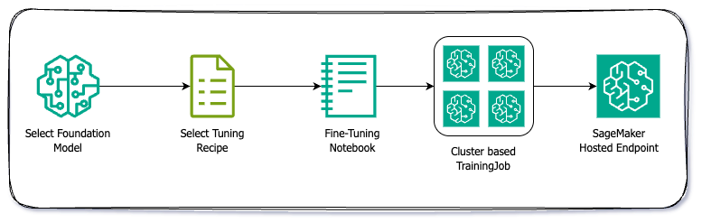

# Amazon SageMaker OpenSource (OSS) Recipe

A comprehensive collection of OSS training recipes for fine-tuning foundation models on Amazon SageMaker AI using HuggingFace's open-source libraries. This repository provides production-ready configurations for various model families and training methodologies.

## Table of Contents

- [Overview](#overview)
- [Key Features](#key-features)
- [Model Customization on Amazon SageMaker AI](#model-customization-on-amazon-sagemaker-ai)
  - [Supervised Fine-Tuning](#supervised-fine-tuning)
  - [Available Models and Recipes](#available-models-and-recipes)
- [Quick Start](#quick-start)
- [Training Methods](#training-methods)
- [Recipe Structure](#recipe-structure)
- [Advanced Features](#advanced-features)
- [Data Format](#data-format)
- [Performance Optimization](#performance-optimization)
- [Monitoring and Logging](#monitoring-and-logging)
- [Troubleshooting](#troubleshooting)
- [Running Locally on an EC2/Self-Managed Instance](#running-locally-on-an-ec2self-managed-instance)
- [Contributing](#contributing)
- [License](#license)
- [Support](#support)

## Overview

This repository provides a comprehensive framework for model customization on Amazon SageMaker AI, supporting multiple training paradigms from supervised fine-tuning to preference optimization and pre-training. Built on HuggingFace's open-source ecosystem, it offers production-ready configurations for various model families and training methodologies.

## Key Features

### Training Capabilities
- **Multiple Training Methods**: LoRA, Spectrum, and Full fine-tuning
- **Advanced Quantization**: Support for 4-bit quantization (BitsAndBytes, MXFP4)
- **Distributed Training**: Built-in support for multi-GPU and multi-node training
- **Memory Optimization**: Gradient checkpointing, Flash Attention 2, Liger Kernel
- **Flexible Data Loading**: Support for JSONL files and HuggingFace datasets
- **Checkpoint Management**: Automatic checkpoint saving and resumption

### Production Features
- **SageMaker Integration**: Optimized for SageMaker Training Jobs
- **Comprehensive Logging**: TensorBoard integration and detailed metrics
- **Model Deployment**: Automatic model saving for inference deployment
- **Recipe-based Configuration**: YAML-based configuration management

## Model Customization on Amazon SageMaker AI




### Supervised Fine-Tuning (SFT): Theory and Practical Foundations

[Supervised Fine-Tuning (SFT)](https://docs.aws.amazon.com/sagemaker/latest/dg/nova-fine-tune.html) is the process of adapting pre-trained Large Language Models (LLMs) to specific tasks using labeled datasets. SFT combines the broad generalization abilities learned during large-scale pre-training with targeted supervision, allowing the model to exhibit domain-specific behaviors while retaining foundational knowledge. The training objective typically minimizes next-token cross-entropy over curated input–output pairs, enabling applications such as instruction following, domain adaptation, classification, summarization, and safety alignment.

SFT methods vary in how many parameters they update and how much representational change they can induce. Three major approaches—LoRA, Spectrum Training, and Full Fine-Tuning—span the efficiency/performance spectrum and offer practitioners different trade-offs depending on resource constraints and task complexity.

---

#### LoRA (Low-Rank Adaptation)

LoRA introduces learnable low-rank matrices into selected model layers while keeping the original weights frozen. Instead of updating the full weight matrix **W**, LoRA learns a decomposition:

\[
\Delta W = A B^T \quad \text{where} \quad \text{rank}(A B^T) \ll \text{rank}(W)
\]

##### Theoretical Basis
- Fine-tuning updates often lie in low-dimensional subspaces; therefore, they can be effectively represented using low-rank approximations.
- Injecting parameter-efficient updates preserves the base model while allowing meaningful adaptation.

##### Practical Characteristics
- **Extremely parameter-efficient**, enabling training on smaller GPUs.
- **Minimal memory overhead**, since only low-rank matrices are trained.
- **Fast iteration cycles**, making it suitable for experimentation.
- **Supports multiple adapters**, allowing one base model to serve many domains.

##### Ideal Use Cases
- Instruction-following tasks  
- Lightweight domain adaptation  
- Scenarios requiring rapid prototyping or memory-constrained deployment  
- Multi-adapter or multi-tenant workflows  

---

#### Spectrum Training (Selective Parameter Fine-Tuning)

Spectrum Training selectively unfreezes specific parts of the model—such as attention blocks, MLP modules, embeddings, or normalization layers—based on configurable patterns. It provides a controlled middle ground between LoRA and full end-to-end training.

##### Theoretical Basis
- Different tasks rely on different anatomical components of the model; unfreezing only the most relevant submodules allows targeted representational shifts.
- Selective adaptation captures most of the benefit of full fine-tuning without redundant updates to unrelated layers.

##### Practical Characteristics
- **Higher capacity than LoRA**, enabling deeper task specialization.
- **Lower computational cost than full fine-tuning** because only a subset of parameters is updated.
- **Fine-grained flexibility**, useful for ablation studies or principled adaptation strategies.

##### Ideal Use Cases
- Tasks where LoRA underperforms but full fine-tuning is unnecessary or too expensive  
- Domains requiring moderate representational shifts  
- Scenarios where experts can identify the most task-relevant layers  

---

#### Full Fine-Tuning (End-to-End Parameter Updates)

Full fine-tuning trains **all** parameters of the LLM, allowing the model to completely reorganize internal representations. This provides maximum expressive power at the cost of high computational and memory requirements.

##### Theoretical Basis
- End-to-end training enables the model to align all layers to new distributions, making it suitable for domains that diverge significantly from pre-training corpora.
- Full adaptation is sometimes necessary when the task requires deep architectural-level changes in reasoning pathways or language style.

##### Practical Characteristics
- **Highest performance potential**, especially for specialized or heavily domain-shifted tasks.
- **Significant resource requirements**, including high-end multi-GPU or distributed training setups.
- **Ideal for mission-critical workloads** with strict accuracy requirements.

##### Ideal Use Cases
- Biomedical, legal, scientific, or financial domains with unique linguistic structure  
- Complex reasoning applications requiring deep model re-alignment  
- Workloads with sufficient GPU capacity where peak performance is essential  

---

#### Comparing the Three SFT Approaches

| Method | Trainable Parameters | Compute Cost | Adaptation Depth | Strengths |
|--------|----------------------|--------------|------------------|-----------|
| **LoRA** | Very Low | Very Low | Moderate | Adapter-based flexibility, fast training, minimal memory |
| **Spectrum** | Medium (Configurable) | Medium | High | Balanced efficiency, selective adaptation, tunable complexity |
| **Full Fine-Tuning** | All Parameters | High | Maximum | Best performance for large domain shifts or highly specialized tasks |


Supervised Fine-Tuning provides a principled way to specialize LLMs to new tasks while leveraging the power of pre-training. LoRA enables efficient and scalable customization, Spectrum Training offers a flexible mid-point with stronger adaptation capacity, and Full Fine-Tuning delivers maximal expressiveness for domains requiring deep model transformation. The optimal choice depends on compute availability, domain shift, and the performance requirements of the downstream application.


#### Available Models and Recipes

| Model | Modality | Reasoning | QLoRA | Spectrum | Full | Notebook | Notes |
|-------|----------|-----------|-------|----------|------|----------|-------|
| | | | | | | | |
| **🦙 Meta (Llama)** | | | | | | | |
| meta-llama/Llama-3.2-3B-Instruct | Text to Text | No | ✅ [QLoRA](supervised_finetuning/sagemaker_code/hf_recipes/meta-llama/Llama-3.2-3B-Instruct--vanilla-peft-qlora.yaml) | ✅ [Spectrum](supervised_finetuning/sagemaker_code/hf_recipes/meta-llama/Llama-3.2-3B-Instruct--vanilla-spectrum.yaml) | ✅ [Full](supervised_finetuning/sagemaker_code/hf_recipes/meta-llama/Llama-3.2-3B-Instruct--vanilla-full.yaml) | 📓 [Notebook](supervised_finetuning/finetune--meta-llama--Llama-3.2-3B-Instruct.ipynb) | Flash Attention 2, compact model |
| meta-llama/Llama-3.3-70B-Instruct | Text to Text | No | ✅ [QLoRA](supervised_finetuning/sagemaker_code/hf_recipes/meta-llama/Llama-3.3-70B-Instruct--vanilla-peft-qlora.yaml) | ✅ [Spectrum](supervised_finetuning/sagemaker_code/hf_recipes/meta-llama/Llama-3.3-70B-Instruct--vanilla-spectrum.yaml) | ✅ [Full](supervised_finetuning/sagemaker_code/hf_recipes/meta-llama/Llama-3.3-70B-Instruct--vanilla-full.yaml) | 📓 [Notebook](supervised_finetuning/finetune--meta-llama--Llama-3.3-70B-Instruct.ipynb) | Large scale model, enhanced capabilities |
| meta-llama/Llama-3.2-11B-Vision-Instruct | Image, Text to Text | No | ✅ [QLoRA](supervised_finetuning/sagemaker_code/hf_recipes/meta-llama/Llama-3.2-11B-Vision-Instruct--vanilla-peft-qlora.yaml) | ✅ [Spectrum](supervised_finetuning/sagemaker_code/hf_recipes/meta-llama/Llama-3.2-11B-Vision-Instruct--vanilla-spectrum.yaml) | ✅ [Full](supervised_finetuning/sagemaker_code/hf_recipes/meta-llama/Llama-3.2-11B-Vision-Instruct--vanilla-full.yaml) | 📓 [Notebook](supervised_finetuning/finetune--meta-llama--Llama-3.2-11B-Vision-Instruct.ipynb) | Vision-language model |
| meta-llama/Llama-4-Maverick-17B-128E-Instruct | Image, Text to Text | No | ✅ [QLoRA](supervised_finetuning/sagemaker_code/hf_recipes/meta-llama/Llama-4-Maverick-17B-128E-Instruct--vanilla-peft-qlora.yaml) | ✅ [Spectrum](supervised_finetuning/sagemaker_code/hf_recipes/meta-llama/Llama-4-Maverick-17B-128E-Instruct--vanilla-spectrum.yaml) | ✅ [Full](supervised_finetuning/sagemaker_code/hf_recipes/meta-llama/Llama-4-Maverick-17B-128E-Instruct--vanilla-full.yaml) | 📓 [Notebook](supervised_finetuning/finetune--meta-llama--Llama-4-Maverick-17B-128E-Instruct.ipynb) | MoE vision-language model, 128 experts |
| | | | | | | | |
| **🤖 OpenAI** | | | | | | | |
| openai/gpt-oss-20b | Text to Text | Yes | ✅ [QLoRA](supervised_finetuning/sagemaker_code/hf_recipes/openai/gpt-oss-20b--vanilla-peft-qlora.yaml) | ✅ [Spectrum](supervised_finetuning/sagemaker_code/hf_recipes/openai/gpt-oss-20b--vanilla-spectrum.yaml) | ✅ [Full](supervised_finetuning/sagemaker_code/hf_recipes/openai/gpt-oss-20b--vanilla-full.yaml) | 📓 [Notebook](supervised_finetuning/finetune--openai--gpt-oss-20b.ipynb) | 4-bit quantization, optimized for efficiency |
| openai/gpt-oss-120b | Text to Text | Yes | ✅ [QLoRA](supervised_finetuning/sagemaker_code/hf_recipes/openai/gpt-oss-120b--vanilla-peft-qlora.yaml) | ✅ [Spectrum](supervised_finetuning/sagemaker_code/hf_recipes/openai/gpt-oss-120b--vanilla-spectrum.yaml) | ✅ [Full](supervised_finetuning/sagemaker_code/hf_recipes/openai/gpt-oss-120b--vanilla-full.yaml) | 📓 [Notebook](supervised_finetuning/finetune--openai--gpt-oss-120b.ipynb) | Large scale model, 4-bit quantization |
| | | | | | | | |
| **🔮 Qwen (Alibaba)** | | | | | | | |
| Qwen/Qwen2.5-3B-Instruct | Text to Text | No | ✅ [QLoRA](supervised_finetuning/sagemaker_code/hf_recipes/Qwen/Qwen2.5-3B-Instruct--vanilla-peft-qlora.yaml) | ✅ [Spectrum](supervised_finetuning/sagemaker_code/hf_recipes/Qwen/Qwen2.5-3B-Instruct--vanilla-spectrum.yaml) | ✅ [Full](supervised_finetuning/sagemaker_code/hf_recipes/Qwen/Qwen2.5-3B-Instruct--vanilla-full.yaml) | 📓 [Notebook](supervised_finetuning/finetune--Qwen--Qwen2.5-3B-Instruct.ipynb) | Compact, efficient model |
| Qwen/QwQ-32B | Text to Text | Yes | ✅ [QLoRA](supervised_finetuning/sagemaker_code/hf_recipes/Qwen/QwQ-32B--vanilla-peft-qlora.yaml) | ✅ [Spectrum](supervised_finetuning/sagemaker_code/hf_recipes/Qwen/QwQ-32B--vanilla-spectrum.yaml) | ✅ [Full](supervised_finetuning/sagemaker_code/hf_recipes/Qwen/QwQ-32B--vanilla-full.yaml) | 📓 [Notebook](supervised_finetuning/finetune--Qwen--QwQ-32B.ipynb) | Reasoning-focused model |
| Qwen/Qwen2-Audio-7B-Instruct | Audio, Text to Text | No | ✅ [QLoRA](supervised_finetuning/sagemaker_code/hf_recipes/Qwen/Qwen2-Audio-7B-Instruct-vanilla-peft-qlora.yaml) | ❌ Unsupported | ✅ [Full](supervised_finetuning/sagemaker_code/hf_recipes/Qwen/Qwen2-Audio-7B-Instruct-vanilla-full.yaml) | 📓 [Notebook](supervised_finetuning/finetune--Qwen--Qwen2-Audio-7B-Instruct.ipynb) | Audio-language model |
| | | | | | | | |
| **🧠 DeepSeek** | | | | | | | |
| deepseek-ai/DeepSeek-R1-0528 | Text to Text | Yes | ✅ [QLoRA](supervised_finetuning/sagemaker_code/hf_recipes/deepseek-ai/DeepSeek-R1-0528--vanilla-peft-qlora.yaml) | ✅ [Spectrum](supervised_finetuning/sagemaker_code/hf_recipes/deepseek-ai/DeepSeek-R1-0528--vanilla-spectrum.yaml) | ✅ [Full](supervised_finetuning/sagemaker_code/hf_recipes/deepseek-ai/DeepSeek-R1-0528--vanilla-full.yaml) | 📓 [Notebook](supervised_finetuning/finetune--deepseek-ai--DeepSeek-R1-0528.ipynb) | Advanced reasoning model |
| deepseek-ai/DeepSeek-R1-Distill-Qwen-1.5B | Text to Text | Yes | ✅ [QLoRA](supervised_finetuning/sagemaker_code/hf_recipes/deepseek-ai/DeepSeek-R1-Distill-Qwen-1.5B--vanilla-peft-qlora.yaml) | ✅ [Spectrum](supervised_finetuning/sagemaker_code/hf_recipes/deepseek-ai/DeepSeek-R1-Distill-Qwen-1.5B--vanilla-spectrum.yaml) | ✅ [Full](supervised_finetuning/sagemaker_code/hf_recipes/deepseek-ai/DeepSeek-R1-Distill-Qwen-1.5B--vanilla-full.yaml) | 📓 [Notebook](supervised_finetuning/finetune--deepseek-ai--DeepSeek-R1-Distill-Qwen-1.5B.ipynb) | Compact reasoning model, distilled from R1 |
| | | | | | | | |
| **🔬 Microsoft** | | | | | | | |
| microsoft/Phi-3-mini-128k-instruct | Text to Text | No | ✅ [QLoRA](supervised_finetuning/sagemaker_code/hf_recipes/microsoft/Phi-3-mini-128k-instruct--vanilla-peft-qlora.yaml) | ✅ [Spectrum](supervised_finetuning/sagemaker_code/hf_recipes/microsoft/Phi-3-mini-128k-instruct--vanilla-spectrum.yaml) | ✅ [Full](supervised_finetuning/sagemaker_code/hf_recipes/microsoft/Phi-3-mini-128k-instruct--vanilla-full.yaml) | 📓 [Notebook](supervised_finetuning/finetune--microsoft--Phi-3-mini-128k-instruct.ipynb) | Compact model, 128K context window |
| microsoft/phi-4 | Text to Text | No | ✅ [QLoRA](supervised_finetuning/sagemaker_code/hf_recipes/microsoft/phi-4--vanilla-peft-qlora.yaml) | ✅ [Spectrum](supervised_finetuning/sagemaker_code/hf_recipes/microsoft/phi-4--vanilla-spectrum.yaml) | ✅ [Full](supervised_finetuning/sagemaker_code/hf_recipes/microsoft/phi-4--vanilla-full.yaml) | 📓 [Notebook](supervised_finetuning/finetune--microsoft--phi-4.ipynb) | Advanced reasoning and coding capabilities |
| | | | | | | | |
| **🌟 Google** | | | | | | | |
| google/gemma-3-4b-it | Text to Text | No | ✅ [QLoRA](supervised_finetuning/sagemaker_code/hf_recipes/google/gemma-3-4b-it--vanilla-peft-qlora.yaml) | ❌ Unsupported | ✅ [Full](supervised_finetuning/sagemaker_code/hf_recipes/google/gemma-3-4b-it--vanilla-full.yaml) | 📓 [Notebook](supervised_finetuning/finetune--google--gemma-3-4b-it.ipynb) | Efficient 4B model |
| google/gemma-3-27b-it | Text to Text | No | ✅ [QLoRA](supervised_finetuning/sagemaker_code/hf_recipes/google/gemma-3-27b-it--vanilla-peft-qlora.yaml) | ❌ Unsupported | ✅ [Full](supervised_finetuning/sagemaker_code/hf_recipes/google/gemma-3-27b-it--vanilla-full.yaml) | 📓 [Notebook](supervised_finetuning/finetune--google--gemma-3-27b-it.ipynb) | Latest Gemma model, instruction-tuned |

#### Crafting your Own OSS Recipes

Fine-tuning recipes in this framework follow a consistent YAML structure that cleanly separates model configuration, dataset parameters, adaptation method (LoRA, Spectrum, or Full), training hyperparameters, and logging settings. Understanding this structure makes it straightforward to author new recipes or modify existing ones to fit your model, dataset, or training environment.

A recipe acts as a **single source of truth** for all fine-tuning decisions—model architecture, precision, target modules, optimization strategy, scheduling, and experiment tracking. Each block is declarative, making it easy to version, store in Git, share within teams, or auto-load into training scripts.

Here's an example of a recipe for fine-tuning a model with LoRA:

##### Example: Minimal Template for a New Recipe

```yaml
# Model arguments
model_name_or_path: <model-path>
tokenizer_name_or_path: <tokenizer-path>
torch_dtype: bfloat16
output_dir: <output-directory>

# Dataset arguments
dataset_id_or_path: <dataset-path>
max_seq_length: 4096
packing: false

# Adaptation method (choose one)
use_peft: true                # For LoRA (set to false for full FT)
lora_target_modules: "all-linear"
lora_r: 8
lora_alpha: 16

# or Spectrum
# spectrum_config_path: configs/spectrum/<your-config>.yaml

# Training arguments
num_train_epochs: 1
per_device_train_batch_size: 2
gradient_accumulation_steps: 2
learning_rate: 1e-4
lr_scheduler_type: cosine

# Logging arguments
report_to:
- mlflow
run_name: <experiment-name>
save_strategy: epoch
seed: 42
```

Below is a breakdown of the core sections and how they should be customized.

---

##### 1. **Model Arguments**
Defines the base model and tokenizer to load, along with precision and architectural settings.

Key fields:
- `model_name_or_path`: HF Hub ID or local model path  
- `tokenizer_name_or_path`: typically matches the model path  
- `torch_dtype`: precision format (`bfloat16`, `float16`, `auto`)  
- `attn_implementation`: attention backend (`flash_attention_2`, `eager`, etc.)  
- `output_dir`: where checkpoints and merged models will be saved  

Update this section when:
- switching to a new model family  
- switching tokenizer variants  
- changing precision to match hardware  
- storing results in a different directory  

---

##### 2. **Dataset Arguments**
Controls how the training dataset is loaded and how sequences are tokenized.

Key fields:
- `dataset_id_or_path`: local JSONL or HF dataset  
- `max_seq_length`: context length for tokenization  
- `packing`: whether multiple sequences are packed into one window  

Update this section when:
- changing datasets  
- modifying maximum sequence context  
- enabling/disabling sequence packing for throughput  

---

##### 3. **Adaptation Method (LoRA / Spectrum / Full Fine-Tuning)**
This section determines which fine-tuning strategy is used and what parameters are updated.

###### **LoRA**
Includes:
- `use_peft: true`
- `lora_target_modules`: which modules get low-rank adapters  
- `lora_r`, `lora_alpha`: rank and scaling  
- `lora_modules_to_save`: optional modules to retain outside adapters  

Update LoRA settings when:
- tuning only attention, MLPs, or mixture-of-experts blocks  
- experimenting with different low-rank sizes  
- creating adapters for specialized domains  

###### **Spectrum Training**
Includes:
- `spectrum_config_path`: YAML file describing which layers to unfreeze  
- `mxfp4`: model-quantized weight format (specific to GPT-OSS models)

Update Spectrum settings when:
- unfreezing different percentages of parameters  
- targeting specific layers for deeper adaptation  
- changing the pattern of trainable blocks  

###### **Full Fine-Tuning**
Only requires:
- no `use_peft`  
- no `spectrum_config_path`  
- optionally `mxfp4` for weight conversion  

Update full fine-tuning when:
- moving from adapters to end-to-end training  
- switching GPU hardware that supports different precisions  
- customizing training for large domain shifts  

---

##### 4. **Training Arguments**
Defines how the optimization is performed.

Important parameters:
- `num_train_epochs`  
- `per_device_train_batch_size`  
- `gradient_accumulation_steps`  
- `gradient_checkpointing`  
- `learning_rate`  
- `lr_scheduler_type`  
- `warmup_ratio`  

Update this section when:
- scaling up batch size on larger clusters  
- lowering learning rate for delicate domains (e.g., medical/legal)  
- enabling gradient checkpointing to reduce memory  
- switching schedulers (cosine, linear, polynomial)  

---

##### 5. **Logging and Experiment Tracking**
Controls how progress is recorded.

Key fields:
- `report_to: ["mlflow"]` or `["tensorboard"]`  
- `run_name`: helps identify experiment lineage  
- `logging_strategy` / `logging_steps`  
- `save_strategy`: checkpoint frequency  
- `seed`: reproducibility  

Update this section when:
- creating new experiment families  
- using MLflow/Tensorboard for tracking  
- adjusting checkpoint frequency for long jobs  

#### Putting it all together!

                            ┌───────────────────────────┐
                            │   Start With a Template   │
                            │  (LoRA / Spectrum / Full) │
                            └─────────────┬─────────────┘
                                          │
                                          ▼
                            ┌───────────────────────────┐
                            │   Update Model Section    │
                            │ - model path              │
                            │ - tokenizer path          │
                            │ - dtype / precision       │
                            │ - output directory        │
                            └─────────────┬─────────────┘
                                          │
                                          ▼
                            ┌────────────────────────────┐
                            │     Configure Dataset      │
                            │ - dataset path             │
                            │ - seq length               │
                            │ - packing setting          │
                            └─────────────┬──────────────┘
                                          │
                                          ▼
            ┌──────────────────────────────────────────────────────────┐
            │                 Choose Adaptation Method                 │
            │──────────────────────────────────────────────────────────│
            │   LoRA:     use_peft: true, r/alpha, target modules      │
            │   Spectrum: spectrum_config_path: <yaml>                 │
            │   Full FT:  update all params, no adapters               │
            └───────────────────────────────┬──────────────────────────┘
                                            │
                                            ▼
                            ┌────────────────────────────┐
                            │     Set Training Params    │
                            │ - epochs                   │
                            │ - batch size               │
                            │ - grad accumulation        │
                            │ - lr + scheduler           │
                            │ - checkpointing            │
                            └─────────────┬──────────────┘
                                          │
                                          ▼
                            ┌────────────────────────────┐
                            │      Configure Logging     │
                            │ - MLflow / W&B             │
                            │ - run name                 │
                            │ - save strategy            │
                            │ - seed                     │
                            └─────────────┬──────────────┘
                                          │
                                          ▼
            ┌──────────────────────────────────────────────────────────┐
            │         Validate YAML Structure & Paths                  │
            │ - indentation                                            │
            │ - local/remote paths                                     │
            │ - config loads without error                             │
            └─────────────────────────────┬────────────────────────────┘
                                          │
                                          ▼
            ┌──────────────────────────────────────────────────────────┐
            │         Run a Dry-Run Using --config                     │
            │     (Validate before large-scale training)               │
            └──────────────────────────────────────────────────────────┘


1. **Start by duplicating the closest existing recipe**  
   Choose LoRA, Spectrum, or Full Fine-Tuning as a template depending on your needs.

2. **Update the model section**  
   Replace the model path, tokenizer, and precision choices based on the base model you are using.

3. **Specify the dataset**  
   Point to your training JSONL or HF dataset and adjust `max_seq_length`.

4. **Select the fine-tuning method**  
   - Add **LoRA blocks** for parameter-efficient training.  
   - Add a **Spectrum config path** if selectively unfreezing layers.  
   - Remove both for full training.  

5. **Tune training hyperparameters**  
   Adjust batch size, learning rate, scheduler, and epochs based on hardware and dataset size.

6. **Configure logging**  
   Set the `run_name`, MLflow/W&B settings, and checkpoint/save strategy.

7. **Validate paths and indentation**  
   YAML is indentation-sensitive—ensure that nested structures like `gradient_checkpointing_kwargs` remain aligned.

8. **Run a dry-run**  
   Use the training script’s `--config` flag to validate that all parameters load correctly before kicking off large jobs.


### Preference Optimization

Preference Optimization represents the next frontier in model alignment, focusing on training models to generate outputs that align with human preferences and values. Unlike supervised fine-tuning which learns from demonstrations, preference optimization learns from comparative feedback, making models more helpful, harmless, and honest.

**Direct Preference Optimization (DPO)** revolutionizes the traditional RLHF pipeline by directly optimizing the model on preference data without requiring a separate reward model. This approach simplifies the training process while maintaining effectiveness, making it more stable and computationally efficient. DPO works by directly optimizing the policy to increase the likelihood of preferred responses while decreasing the likelihood of rejected ones, using a reference model to prevent over-optimization.

**Group Relative Policy Optimization (GRPO)** extends preference optimization to handle group-based preferences and multi-objective alignment. This approach is particularly valuable when dealing with diverse user groups or when optimizing for multiple, potentially conflicting objectives simultaneously. GRPO enables more nuanced preference learning that can adapt to different contexts and user populations.

These preference optimization techniques are essential for creating models that not only perform well on benchmarks but also generate outputs that users find genuinely helpful and aligned with their values and expectations.

| Model | DPO | GRPO | Notes |
|-------|-----|------|-------|
| | | | |
| **🔮 Qwen (Alibaba)** | | | |
| Qwen/Qwen2.5-3B-Instruct| | ✅ [GRPO](preference_optimization/grpo/grpo-recipe/sagemaker_code/hf_recipes/qwen/Qwen-2.5-3B-Instruct--oreo-grpo.yaml)| Countdown game reward function |
| | | | |
| **🦙 Meta (Llama)** | | | | | | | |
| meta-llama/Llama-3.2-3B-Instruct | | ✅ [GRPO](preference_optimization/grpo/grpo-recipe/sagemaker_code/hf_recipes/meta-llama/Llama-3.2-3B-Instruct--oreo-grpo.yaml) | Countdown game reward function |
| | | | |
| **🚧 More Models Coming Soon** | ⏳ | ⏳ | Preference optimization recipes in development |

### Pre-Training

Pre-training represents the foundational phase of large language model development, where models learn rich representations from vast amounts of unlabeled text data. This process creates the base knowledge and capabilities that can later be specialized through fine-tuning and alignment techniques.

**Autoregressive Language Modeling** forms the core of modern pre-training, where models learn to predict the next token in a sequence given the previous context. This seemingly simple objective enables models to develop sophisticated understanding of language, reasoning capabilities, and world knowledge. The scale of pre-training data and compute directly impacts the emergent capabilities of the resulting models.

**Distributed Pre-training** requires careful orchestration of training across multiple GPUs and nodes, involving techniques like data parallelism, model parallelism, and pipeline parallelism. Efficient pre-training also leverages advanced optimizations such as gradient accumulation, mixed precision training, and dynamic loss scaling to maximize throughput while maintaining numerical stability.

**Curriculum Learning and Data Composition** play crucial roles in pre-training effectiveness, involving strategic sequencing of training data and careful balancing of different data sources. Modern pre-training approaches also incorporate techniques like data deduplication, quality filtering, and domain-specific sampling to optimize the learning process.

Pre-training on Amazon SageMaker AI enables practitioners to create custom foundation models tailored to specific domains, languages, or use cases, providing the flexibility to build models that capture domain-specific knowledge and patterns not present in general-purpose models.

| Model | Autoregressive | Distributed | Curriculum | Notes |
|-------|---------------|-------------|------------|-------|
| | | | | |
| **🚧 Coming Soon** | ⏳ | ⏳ | ⏳ | Pre-training recipes in development |

## Quick Start

### 1. Basic Usage

```bash
# Run with a recipe configuration
python supervised_finetuning/sagemaker_code/sft.py --config supervised_finetuning/sagemaker_code/hf_recipes/meta-llama/Llama-3.2-3B-Instruct--vanilla-peft-qlora.yaml

# Override specific parameters
python supervised_finetuning/sagemaker_code/sft.py \
    --config supervised_finetuning/sagemaker_code/hf_recipes/meta-llama/Llama-3.2-3B-Instruct--vanilla-peft-qlora.yaml \
    --num_train_epochs 3 \
    --learning_rate 1e-4
```

### 2. SageMaker Training Job

```python
from sagemaker.pytorch import PyTorch

# Configure SageMaker estimator
estimator = PyTorch(
    entry_point='sft.py',
    source_dir='supervised_finetuning/sagemaker_code',
    role=role,
    instance_type='ml.g5.2xlarge',
    instance_count=1,
    framework_version='2.0.0',
    py_version='py310',
    hyperparameters={
        'config': 'hf_recipes/meta-llama/Llama-3.2-3B-Instruct--vanilla-peft-qlora.yaml'
    }
)

# Start training
estimator.fit({'training': 's3://your-bucket/training-data/'})
```

## Training Methods

### LoRA (Low-Rank Adaptation)
Parameter-efficient fine-tuning that adds trainable low-rank matrices to existing layers.

**Benefits:**
- Significantly reduced memory usage
- Faster training times
- Easy to merge and deploy
- Maintains base model performance

**Configuration:**
```yaml
use_peft: true
load_in_4bit: true
lora_target_modules: "all-linear"
lora_r: 16
lora_alpha: 16
```

### Spectrum Training
Selective parameter unfreezing based on configurable patterns for targeted fine-tuning.

**Benefits:**
- Fine-grained control over parameter updates
- Balanced approach between efficiency and performance
- Customizable parameter selection

**Configuration:**
```yaml
spectrum_config_path: supervised_finetuning/sagemaker_code/configs/spectrum/meta-llama/snr_results_meta-llama-Llama-3.2-3B-Instruct_unfrozenparameters_30percent.yaml
```

**Available Spectrum Configurations:**
- Meta-Llama models: `supervised_finetuning/sagemaker_code/configs/spectrum/meta-llama/`
- OpenAI models: `supervised_finetuning/sagemaker_code/configs/spectrum/openai/`
- Qwen models: `supervised_finetuning/sagemaker_code/configs/spectrum/Qwen/`
- DeepSeek models: `supervised_finetuning/sagemaker_code/configs/spectrum/deepseek-ai/`

### Full Fine-tuning
Traditional approach that updates all model parameters.

**Benefits:**
- Maximum model adaptation capability
- Best performance for domain-specific tasks
- Complete model customization

**Configuration:**
```yaml
use_peft: false
```

## Recipe Structure

Each recipe is a YAML configuration file containing:

```yaml
# Model Configuration
model_name_or_path: meta-llama/Llama-3.2-3B-Instruct
tokenizer_name_or_path: meta-llama/Llama-3.2-3B-Instruct
model_revision: main
torch_dtype: bfloat16
attn_implementation: flash_attention_2
use_liger: false
bf16: true
tf32: true
output_dir: /opt/ml/output/meta-llama/Llama-3.2-3B-Instruct/peft-qlora/

# Dataset Configuration
dataset_id_or_path: /opt/ml/input/data/training/dataset.jsonl
max_seq_length: 4096
packing: true

# Training Configuration
num_train_epochs: 1
per_device_train_batch_size: 8
gradient_accumulation_steps: 2
gradient_checkpointing: true
gradient_checkpointing_kwargs:
  use_reentrant: true
learning_rate: 1.0e-4
lr_scheduler_type: cosine
warmup_ratio: 0.1

# Method-specific Configuration (LoRA)
use_peft: true
load_in_4bit: true
lora_target_modules: "all-linear"
lora_modules_to_save: ["lm_head", "embed_tokens"]
lora_r: 16
lora_alpha: 16

# Logging Configuration
logging_strategy: steps
logging_steps: 5
report_to:
- tensorboard
save_strategy: "epoch"
seed: 42
```

## Advanced Features

### Quantization Options

**4-bit BitsAndBytes (Default)**
```yaml
load_in_4bit: true
mxfp4: false
```

**MXFP4 Quantization**
```yaml
load_in_4bit: true
mxfp4: true
```

### Memory Optimizations

**Gradient Checkpointing**
```yaml
gradient_checkpointing: true
gradient_checkpointing_kwargs:
  use_reentrant: true
```

**Flash Attention**
```yaml
attn_implementation: flash_attention_2
```

**Liger Kernel**
```yaml
use_liger: true
```

## Data Format

### JSONL Format
```json
{"messages": [{"role": "user", "content": "Hello"}, {"role": "assistant", "content": "Hi there!"}]}
{"messages": [{"role": "user", "content": "How are you?"}, {"role": "assistant", "content": "I'm doing well!"}]}
```

### HuggingFace Dataset
```yaml
dataset_id_or_path: "HuggingFaceH4/ultrachat_200k"
dataset_train_split: "train_sft"
dataset_test_split: "test_sft"
```

### Multimodal Data Format

**Audio Models (Qwen2-Audio)**
```yaml
# Audio dataset configuration
dataset_id_or_path: /opt/ml/input/data/training/audio_dataset.jsonl
modality_type: "audio"
processor_name_or_path: Qwen/Qwen2-Audio-7B-Instruct
```

**Vision Models (Llama-3.2-Vision)**
```yaml
# Vision dataset configuration  
dataset_id_or_path: /opt/ml/input/data/training/vision_dataset.jsonl
modality_type: "vision"
processor_name_or_path: meta-llama/Llama-3.2-11B-Vision-Instruct
```

## Performance Optimization

### Memory Usage Guidelines

| Model Size | Recommended Instance | Training Method | Batch Size | Example Models |
|------------|---------------------|-----------------|------------|----------------|
| 1.5B | ml.g5.xlarge | LoRA + 4-bit | 16 | DeepSeek-R1-Distill-Qwen-1.5B |
| 2B | ml.g5.xlarge | LoRA + 4-bit | 8 | Gemma-2B |
| 3B | ml.g5.2xlarge | LoRA + 4-bit | 8 | Llama-3.2-3B-Instruct, Qwen2.5-3B-Instruct, Phi-3-mini-128k-instruct |
| 7B | ml.g5.4xlarge | LoRA + 4-bit | 4 | Qwen2-Audio-7B-Instruct, Florence-2-large |
| 11B | ml.g5.8xlarge | LoRA + 4-bit | 4 | Llama-3.2-11B-Vision-Instruct |
| 14B | ml.g5.12xlarge | LoRA + 4-bit | 2 | Phi-4 |
| 17B (MoE) | ml.g5.12xlarge | LoRA + 4-bit | 2 | Llama-4-Maverick-17B-128E-Instruct |
| 20B | ml.g5.12xlarge | LoRA + 4-bit | 2 | GPT-OSS-20B |
| 27B | ml.g5.24xlarge | LoRA + 4-bit | 1 | Gemma-3-27B-IT |
| 32B | ml.g5.24xlarge | LoRA + 4-bit | 2 | QwQ-32B |
| 70B | ml.p4d.24xlarge | LoRA + 4-bit | 1 | Llama-3.3-70B-Instruct |
| 120B+ | ml.p4d.24xlarge | LoRA + 4-bit | 1 | GPT-OSS-120B, DeepSeek-R1-0528 |

### Training Speed Tips

1. **Use Flash Attention 2**: Reduces memory and increases speed
2. **Enable Gradient Checkpointing**: Trades compute for memory
3. **Optimize Batch Size**: Balance between memory usage and convergence
4. **Use Mixed Precision**: Enable bf16 for better performance

## Monitoring and Logging

### TensorBoard Integration
```yaml
report_to:
  - tensorboard
logging_steps: 5
```

### Metrics Tracking
- Training loss
- Learning rate schedule
- GPU memory usage
- Training throughput

## Troubleshooting

### Common Issues

**Out of Memory (OOM)**
- Reduce `per_device_train_batch_size`
- Enable `gradient_checkpointing`
- Use 4-bit quantization
- Reduce `max_seq_length`

**Slow Training**
- Increase `gradient_accumulation_steps`
- Enable Flash Attention 2
- Use Liger Kernel optimizations
- Optimize data loading

**Model Quality Issues**
- Adjust learning rate (try 5e-5 to 2e-4 range)
- Increase training epochs or adjust warmup ratio
- Check data quality and format (ensure proper JSONL structure)
- Experiment with different LoRA ranks (8, 16, 32, 64)
- For multimodal models, verify processor configuration matches model

**Configuration Issues**
- Ensure recipe paths are correct: `supervised_finetuning/sagemaker_code/hf_recipes/{org}/{model}--vanilla-{method}.yaml`
- Check accelerate config paths: `supervised_finetuning/sagemaker_code/configs/accelerate/{config}.yaml`
- Verify spectrum config paths: `supervised_finetuning/sagemaker_code/configs/spectrum/{org}/{config}.yaml`
- Validate output directory permissions and paths

## Example Notebooks

The repository includes comprehensive Jupyter notebooks demonstrating end-to-end fine-tuning workflows:

### Meta (Llama) Models
- **[Meta Llama 3.2 3B Instruct](supervised_finetuning/finetune--meta-llama--Llama-3.2-3B-Instruct.ipynb)**: Compact text generation model
- **[Meta Llama 3.2 11B Vision Instruct](supervised_finetuning/finetune--meta-llama--Llama-3.2-11B-Vision-Instruct.ipynb)**: Vision-language model
- **[Meta Llama 3.3 70B Instruct](supervised_finetuning/finetune--meta-llama--Llama-3.3-70B-Instruct.ipynb)**: Large-scale text generation
- **[Meta Llama 4 Maverick 17B 128E Instruct](supervised_finetuning/finetune--meta-llama--Llama-4-Maverick-17B-128E-Instruct.ipynb)**: MoE vision-language model

### OpenAI Models
- **[OpenAI GPT-OSS 20B](supervised_finetuning/finetune--openai--gpt-oss-20b.ipynb)**: Mid-scale efficient model
- **[OpenAI GPT-OSS 120B](supervised_finetuning/finetune--openai--gpt-oss-120b.ipynb)**: Large-scale model

### Qwen (Alibaba) Models
- **[Qwen QwQ 32B](supervised_finetuning/finetune--Qwen--QwQ-32B.ipynb)**: Reasoning-focused model
- **[Qwen2 Audio 7B Instruct](supervised_finetuning/finetune--Qwen--Qwen2-Audio-7B-Instruct.ipynb)**: Audio-language model

### DeepSeek Models
- **[DeepSeek R1 0528](supervised_finetuning/finetune--deepseek-ai--DeepSeek-R1-0528.ipynb)**: Advanced reasoning model
- **[DeepSeek R1 Distill 1.5B](supervised_finetuning/finetune--deepseek-ai--DeepSeek-R1-Distill-Qwen-1.5B.ipynb)**: Compact reasoning model

### Microsoft Models
- **[Microsoft Phi-3 Mini 128K Instruct](supervised_finetuning/finetune--microsoft--Phi-3-mini-128k-instruct.ipynb)**: Compact model with extended context
- **[Microsoft Phi-4](supervised_finetuning/finetune--microsoft--phi-4.ipynb)**: Advanced reasoning and coding model

### Google Models
- **[Google Gemma 3 4B IT](supervised_finetuning/finetune--google--gemma-3-4b-it.ipynb)**: Efficient 4B model
- **[Google Gemma 3 27B IT](supervised_finetuning/finetune--google--gemma-3-27b-it.ipynb)**: Latest instruction-tuned Gemma model

Each notebook provides:
- SageMaker setup and configuration
- Dataset preparation and formatting
- Training job execution
- Model evaluation and deployment
- Best practices and optimization tips

## Contributing

We welcome contributions! Please:

1. Add new model recipes following the naming convention: `{org}--{model}--vanilla-{method}.yaml`
2. Test configurations thoroughly on appropriate instance types
3. Update documentation and model support tables
4. Follow the existing YAML structure and include proper logging configuration
5. Add corresponding Jupyter notebooks for new model families


## Running Locally on an EC2/Self-Managed Instance

Start by updating the local instance (assuming a fresh VM),

```bash

sudo apt-get update -y && sudo apt-get install python3-pip python3-venv -y

```

Use uv (recommended to create a virtual env and install packages).

```bash
# install uv package and env manager
sudo pip install uv

# create a py3.XX environment
uv venv py311 --python 3.11

# activate venv
source py311/bin/activate
```

Clone git repo and navigate to the supervised fine-tuning repository

```bash
# clone repository
git clone https://github.com/aws-samples/amazon-sagemaker-generativeai.git

# navigate supervised fine-tuning repository
cd amazon-sagemaker-generativeai/0_model_customization_recipes/supervised_finetuning/
```

Run distributed training using Accelerate orchestrator

```bash
# Set model output directory
SM_MODEL_DIR="/home/ubuntu/amazon-sagemaker-generativeai/0_model_customization_recipes/supervised_finetuning/models"

# Run training with accelerate
accelerate launch \
    --config_file sagemaker_code/configs/accelerate/ds_zero3.yaml \
    --num_processes 1 \
    sagemaker_code/sft.py \
    --config sagemaker_code/hf_recipes/meta-llama/Llama-3.2-3B-Instruct--vanilla-peft-qlora.yaml
```

### Available Accelerate Configurations

- **DeepSpeed ZeRO Stage 1**: `supervised_finetuning/sagemaker_code/configs/accelerate/ds_zero1.yaml`
- **DeepSpeed ZeRO Stage 3**: `supervised_finetuning/sagemaker_code/configs/accelerate/ds_zero3.yaml`
- **FSDP**: `supervised_finetuning/sagemaker_code/configs/accelerate/fsdp.yaml`
- **FSDP with QLoRA**: `supervised_finetuning/sagemaker_code/configs/accelerate/fsdp_qlora.yaml`

## License

This project is licensed under the MIT License - see the [LICENSE](../../LICENSE) file for details.

## Support

For issues and questions:
- Check the troubleshooting section
- Review SageMaker documentation
- Open an issue in this repository

---

**Note**: This framework is optimized for Amazon SageMaker but can be adapted for other distributed training environments.