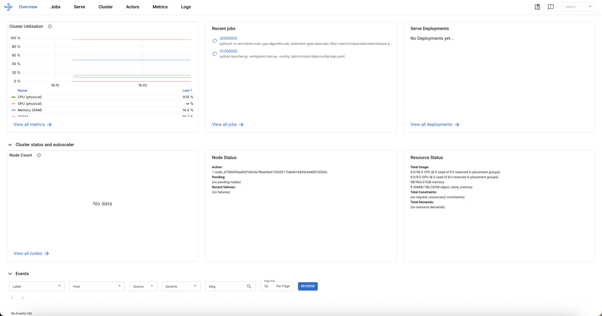
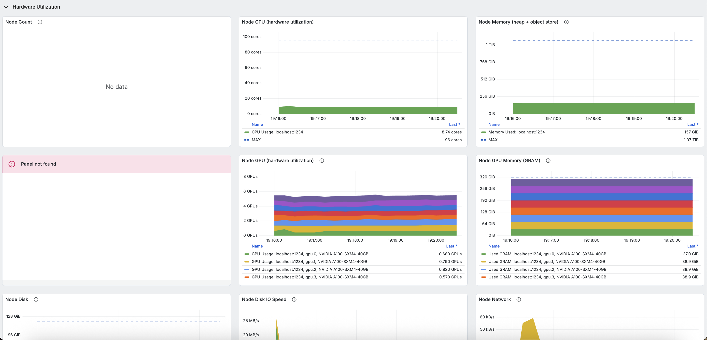

# DeepSeek-R1-Distill-Qwen-7B training with veRL and Ray on Amazon SageMaker training jobs

This repository demonstrates how to use [veRL](https://github.com/volcengine/verl), and [Ray launcher on SageMaker training job](https://github.com/aws-samples/sample-ray-on-amazon-sagemaker-training-jobs) to train [DeepSeek-R1-Distill-Qwen-7B](https://huggingface.co/deepseek-ai/DeepSeek-R1-Distill-Qwen-7B) models for competitive programming tasks on Amazon SageMaker training job.

This code replicates the training setup used for **[CodeFu-7B-v0.1](https://huggingface.co/aws-prototyping/codefu-7b-v0.1)** was trained using this repository. CodeFu is a 7B parameter model trained using Reinforcement Learning for competitive programming tasks. Built on the DeepSeek-R1-Distill-Qwen-7B base model, CodeFu is capable of algorithmic reasoning to solve complex problems and generate efficient C++ solutions.

## Table of Contents

- [Prerequisites](#prerequisites)
- [Project Structure](#project-structure)
- [Key Components](#key-components)
  - [Launcher](#launcher)
  - [Training Script](#training-script)
  - [Required Parameters and Environment Variables](#required-parameters-and-environment-variables)
    - [Parameter Reference](#parameter-reference)
    - [Environment Variables Reference](#environment-variables-reference)
- [Example Usage](#example-usage)
- [Ray Dashboard](#ray-dashboard)
- [Troubleshooting](#troubleshooting)

## Prerequisites

- AWS account with Amazon SageMaker AI access
- Ray 2.0.0+
- Python 3.10+
- Docker (for custom container images)

## Project Structure

```
ray-sagemaker-training/
├── scripts/
│   ├── launcher.py          # Universal Ray launcher for SageMaker
│   ├── train.py            # VERL PPO training script
│   ├── requirements.txt    # Training dependencies
│   └── verl/              # VERL framework code
├── data/                  # Sample datasets
├── docker/               # Docker configuration
├── images/              # Documentation images
├── model-trainer-notebook.ipynb  # Example notebook
└── requirements.txt     # Local development dependencies
```

## Key Components

### Launcher

The `launcher.py` script serves as the universal entry point for SageMaker training jobs and handles:

- Setting up the Ray environment for both single-node and multi-node scenarios
- Coordinating between head and worker nodes in a distributed setup
- Executing custom training scripts with proper environment setup
- Managing Ray cluster lifecycle and graceful shutdown

#### ⚠️ Important Note

**The `launcher.py` script is not intended to be modified by users.** This script serves as a universal entrypoint for SageMaker training jobs and handles Ray cluster setup, coordination between nodes, and execution of your custom scripts.

### Training Script

The `train.py` script demonstrates:

- **Model Download**: Automatic download of Hugging Face models to local storage
- **VERL Integration**: Configuration and execution of VERL PPO training
- **Environment Setup**: Proper configuration of environment variables for distributed training
- **Data Handling**: Flexible data path resolution for training and validation datasets
- **Logging Configuration**: Support for console logging (wandb support available but requires API key)

Key features:

- Downloads models from Hugging Face Hub
- Configures VERL with optimized settings for SageMaker instances
- Supports both single-node and multi-node distributed training
- Handles data path resolution for various file formats (parquet, json, jsonl, csv)

### Required Parameters and Environment Variables

The `launcher.py` script requires specific parameters to execute your custom training scripts. You can configure these through command line arguments or environment variables. For more information, please refer to [Ray on Amazon SageMaker training jobs](https://github.com/aws-samples/sample-ray-on-amazon-sagemaker-training-jobs) repository

## Ray Dashboard

For accessing the Ray Dashboard during training execution, leverage SageMaker's native feature to access [training jobs using AWS Systems Manager (SSM)](https://docs.aws.amazon.com/sagemaker/latest/dg/train-remote-debugging.html).

### Step 1: Setup IAM Permissions

Please refer to the official [AWS Documentation](https://docs.aws.amazon.com/sagemaker/latest/dg/train-remote-debugging.html#train-remote-debugging-iam)

### Step 2: Enable Remote Debugging

Add remote debugging configuration to your ModelTrainer:

```python
from sagemaker.modules.configs import RemoteDebugConfig

model_trainer = ModelTrainer(
    # ... other configuration ...
).with_remote_debug_config(RemoteDebugConfig(enable_remote_debug=True))
```

### Step 3: Access the Training Container

Start port forwarding to the Ray Dashboard port (8265):

```bash
aws ssm start-session --target sagemaker-training-job:<training-job-name>_algo-1 \
--region <aws_region> \
--document-name AWS-StartPortForwardingSession \
--parameters '{"portNumber":["8265"],"localPortNumber":["8265"]}'
```

### Step 4: Access Ray Dashboard

Open your browser and navigate to: `localhost:8265`



---


