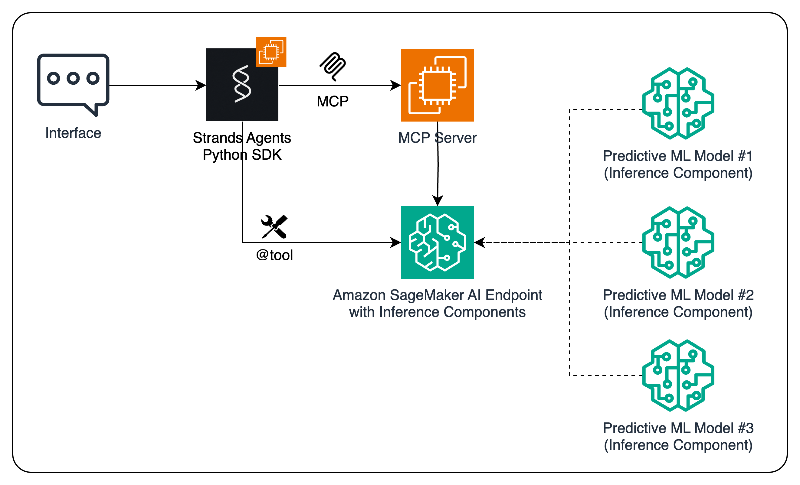

# Using SageMaker Endpoints as Tools for Agents

This lab demonstrates how to integrate Amazon SageMaker endpoints as tools for AI agents, enabling them to leverage machine learning models for specialized tasks.

## Overview

In this lab, you'll learn how to:

1. Train and deploy a demand forecasting model on Amazon SageMaker
2. Create a tool interface that allows AI agents to invoke the SageMaker endpoint
3. Use the SageMaker endpoint as a specialized tool within an agent workflow

## Architecture

The solution follows this workflow:

1. A time series forecasting model is trained using XGBoost on SageMaker
2. The model is deployed to a SageMaker endpoint for real-time inference
3. A tool interface is created using the Model Context Protocol (MCP)
4. The tool is integrated with an agent framework to enable AI agents to make predictions

## Key Components

- **Amazon SageMaker**: For training and hosting the XGBoost forecasting model
- **Model Context Protocol (MCP)**: For creating a standardized tool interface
- **Strands Agents**: For building and orchestrating AI agents that use the SageMaker endpoint

## Files Included

- `demand_forecasting.ipynb`: Jupyter notebook for data preparation and model exploration
- `model-train-and-deploy.py`: Python script for training and deploying the XGBoost model
- `script.py`: SageMaker training and inference script for the XGBoost model
- `server.py`: MCP server implementation for the SageMaker endpoint tool
- `strands-agents-sagemaker-as-tool.ipynb`: Example of using the SageMaker endpoint with agents

## Prerequisites

- An AWS account with access to Amazon SageMaker AI
- Basic understanding of machine learning concepts
- Familiarity with Python and Jupyter notebooks

## Getting Started

1. Review the `demand_forecasting.ipynb` notebook to understand the data and model
2. Explore the `strands-agents-sagemaker-as-tool.ipynb` notebook to see the tool in action

## Learning Objectives

By completing this lab, you will:

- Understand how to train and deploy ML models on Amazon SageMaker AI
- Learn how to create tool interfaces for AI agents using MCP
- Gain experience integrating specialized ML capabilities into agent workflows
- See how agents can leverage ML models for enhanced decision-making
