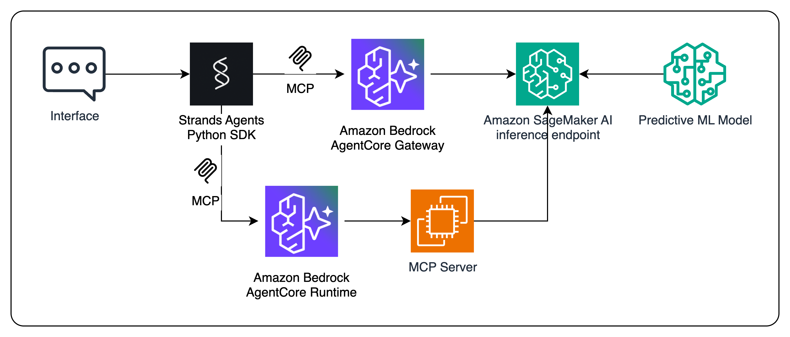

# Using SageMaker AI Endpoints with Amazon Bedrock AgentCore

In this example, you will learn how to leverage a ML model for demand forecasting with your AI Agent. We will use:

1. Amazon SageMaker AI endpoints to deploy the ML model (XGBoost)
2. Amazon Bedrock AgentCore Gateway and Model Context Protocol (MCP) to interact with the endpoint

## How to run

1. Clone this repository and access this folder
2. Train and deploy the demand forecasting model using `1-demand_forecasting.ipynb`
3. Create the Gateway and target the endpoint using `2-agentcore-gateway.ipynb`
4. [coming soon] Host a custom MCP Server using `3-agentcore-runtime.ipynb`
5. Clean up the created resources with `9-cleanup.ipynb`

## Author

[Davide Gallitelli](https://www.linkedin.com/in/dgallitelli/)

## License

Free to use. Not production-ready code. Contributions are welcome.
