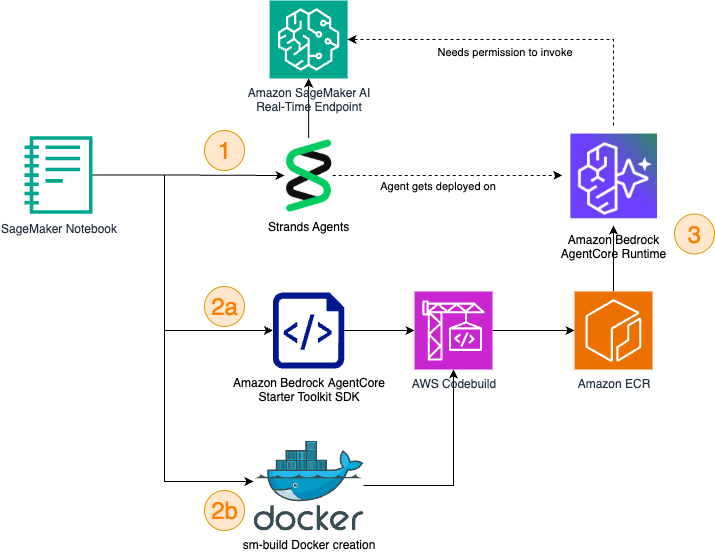

# SageMaker AI + Strands Agents + Amazon Bedrock AgentCore

This repository demonstrates advanced integrations between Amazon SageMaker AI endpoints, Strands Agents framework, and Amazon Bedrock AgentCore Runtime for building and deploying intelligent AI agents.

## Overview

Learn how to:
1. Build AI agents powered by SageMaker AI endpoints
2. Deploy agents to Amazon Bedrock AgentCore Runtime
3. Create scalable, serverless agent architectures
4. Integrate multiple AI capabilities in production environments

## Architecture

The solution enables seamless integration between SageMaker Studio development environment and AgentCore's managed runtime for production agent deployment.

## Examples

### Basic Integration (`1-hello-world-sm-studio-to-agentcore.ipynb`)
- Simple agent creation with SageMaker AI endpoints
- AgentCore Runtime deployment using Bedrock AgentCore Starter Toolkit
- End-to-end workflow from development to production

**Key Features:**
- Strands Agents with SageMakerAIModel integration
- Automated ECR repository and execution role creation
- Local testing and remote deployment
- Proper IAM permissions for SageMaker endpoint access

### Future Examples 
(Coming Soon)

## Cleanup

Each notebook includes cleanup sections to remove:
- AgentCore Runtime instances
- ECR repositories
- IAM roles and policies

## License

MIT-0 License. See LICENSE file for details.