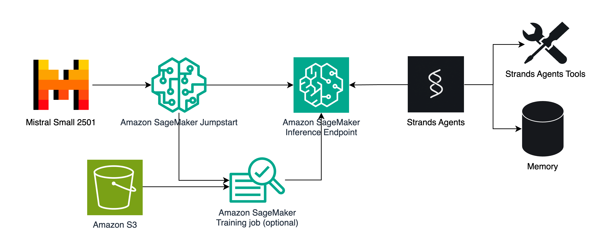

# Using Amazon SageMaker AI with Strands Agents Python SDK



This repository demonstrates the integration between Amazon SageMaker AI and Strands Agents Python SDK (v0.1.4+), allowing you to leverage SageMaker's ML capabilities for building AI agents.

## Key Features

- Native support for Amazon SageMaker AI endpoints in Strands Agents SDK
- Ability to use fine-tuned and custom models from SageMaker JumpStart
- Integration with SageMaker's MLOps features and infrastructure
- Support for real-time, serverless, and asynchronous inference endpoints

## Benefits

- Up to 75% cost optimization through auto-scaling
- High-performance ML infrastructure
- Simplified deployment process
- Built-in model monitoring
- Seamless AWS ecosystem integration

## How to use

- Install your dependecies via `pip install strands-agents strands-agents-tools --quiet --upgrade`
- Deploy a model through SageMaker JumpStart (e.g. Qwen 3 4B)
- Copy the `strands_sagemaker.py` file to the folder where you're building your agent using Strands Agents
- Configure the SageMaker model provider in Strands Agents like so:

```python
from strands.models.sagemaker import SageMakerAIModel
from strands_tools.calculator import calculator
from strands import Agent


endpoint_name = "REPLACE WITH YOUR ENDPOINT NAME"
region_name = "REPLACE WITH YOUR REGION (e.g. us-east-1)"
stream = True # Some models do not support tool calling with streaming!

model = SageMakerAIModel(
    endpoint_config=SageMakerAIModel.SageMakerAIEndpointConfig(endpoint_name=endpoint_name, region_name=region_name),
    payload_config=SageMakerAIModel.SageMakerAIPayloadSchema(max_tokens=4096, stream=stream)
)
agent = Agent(model=model, tools=[calculator])
agent("What is 420*69?")
```

This integration enables creating task-specific AI agents using fine-tuned language models while leveraging SageMaker's robust MLOps platform.
