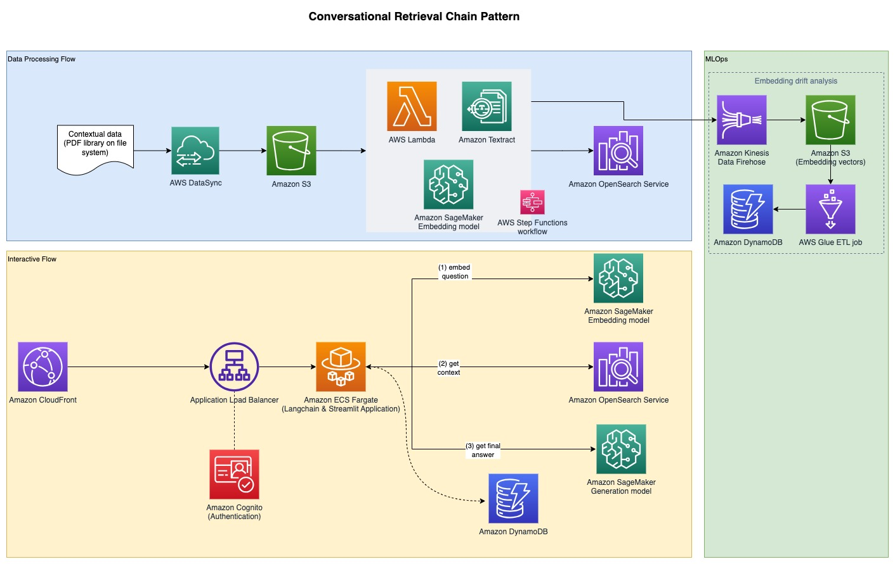

# LLM Application Patterns

This repository contains examples of deployment patterns for a full-stack LLM solution.

## Pattern 1: Retrieval Augmented Generation (RAG) based on PDF documents

This pattern shows how to build a RAG system based on a library of PDF documents.

### Attribution

Parts of this pattern are derived from:

* [Amazon Textract PDF Text Extractor](https://github.com/aws-samples/amazon-textract-pdf-text-extractor/tree/main)

### Deployment

#### Pattern 1: Deploy and use Jupyter Notebook

This patterns allows you to deploy the solution and interact with the solution using a Jupyter notebook

**Prerequisites**

- **SageMaker Jumpstart Model Endpoint Deployment** - Deploy models on Sagemaker Jumpstart, this solution is built based on GPT-J 6B as embedding model and Falcon-40b for text generation
- **Note down Deployment Parameters**:
    - **Text Model Endpoint Name** - The endpoint name of the text generation model deployed with SageMaker Jumpstart
    - **Embeddings Model endpoint Name** - The endpoint name of the embedding model deployed with SageMaker Jumpstart

**Deploy the resources using CDK.**

Using the deployment parameters noted above, deploy the CDK stack. See [here](https://docs.aws.amazon.com/cdk/v2/guide/getting_started.html) for CDK installation

> **NOTE:** Ensure Docker is installed and running on the workstation that will be used for CDK deployment

    $ cd pattern1-rag/cdk
    $ cdk deploy BackendStack --exclusively 
        -c textModelEndpointName=<Enter the SageMaker Endpoint Name for the Text generation model> \
        -c embeddingsModelEndpointName=<Enter the SageMaker Endpoint Name for the Text embeddings model>

Alternatively, you can enter the seven context values in a file called `cdk.context.json` in the `pattern1-rag/cdk` directory and run `cdk deploy BackendStack --exclusively`.

The deployment will print out outputs, some of which will be needed to run the notebook.

**Embed Reference Documents**

For a RAG (Retrieval Augmented Generation) approach, reference documents are first embedded with a Text embedding model and stored in a vector database. In this solution, an ingestion pipeline has been built that intakes PDF documents.

An example EC2 instance has been created for the PDF document ingestion and an EFS filesystem is mounted on the EC2 instance to save the PDF documents. An AWS DataSync task is executed every hours to fetch PDF documents found in the EFS filesystem path and upload them to a S3 bucket to kickoff the text embedding proccess. This process, embeds the reference documents and saves the embeddings in Amazon OpenSearch. It also saves an embedding archive to an S3 bucket through Amazon Kinesis Data Firehose for later analysis. To ingest reference documents, follow the steps below:

1. Retrieve the sample EC2 instance ID that was created (see the CDK output `JumpHostId`) and connect [using SSM Session Manager](https://docs.aws.amazon.com/AWSEC2/latest/UserGuide/session-manager-to-linux.html)
2. Go to the directory `/mnt/efs/fs1` which is where the EFS filesystem is mounted and create a folder `ingest` as seen below
    
        $ cd /mnt/efs/fs1
        $ mkdir ingest && cd ingest

3. Add your reference PDF documents to the `ingest` directory. The DataSync task is configured to upload all files found in this directory to S3 to kickoff the embedding process
4. The DataSync task runs on a hourly schedule, you can optionally kickoff the task manually to start the embedding proccess immediately for the PDF documents you added. To kickoff the task, locate the Task ID from CDK output `DataSyncTaskID` and start the task with defaults as seen [here](https://docs.aws.amazon.com/datasync/latest/userguide/run-task.html#starting-task)

**Question and answering using Jupyter notebook**

1. Retrieve the SageMaker Notebook Instance name from the CDK Output `NotebookInstanceName` and connect to JupyterLab from Amazon SageMaker Notebook Instances console.
2. Go to the directory `fmops/full-stack/pattern1-rag/notebooks/`
3. Open and Run the notebook `query-llm.ipynb` in the notebook instance to perform question and answering using Retrieval Augemented generation (RAG)

#### Pattern 2: Deploy with Streamlit Frontend

This patterns allows you to deploy the solution and a user frontend interface for question and answering

**Prerequisites**

- **SageMaker Jumpstart Model Endpoint Deployment** - Deploy models on Sagemaker Jumpstart, this solution is built based on GPT-J 6B as embedding model and Falcon-40b for text generation
- **Route 53 Hosted Zone** - Create a Route 53 Public hosted zone that will be used for this solution. An existing Public Route 53 hosted zone can also be used e.g. example.com
- **AWS Certificate Manager Certificate** - Provision an AWS Certificate Manager TLS Certificate for the Route 53 Hosted Zone domain namme and its applicable subdomains e.g. example.com and *.example.com for all subdomains. This certificate will be used to configure HTTPS on CloudFront and origin Load balancer
- **Note down Deployment Parameters**:
    - **Frontend App Custom Domain name** - A custom domain name that will be used to access the frontend sample application. The domain name provided will be used to create a Route 53 DNS record pointing to the frontend cloudfront distribution e.g. app.example.com
    - **Load balancer origin custom domain name** - A custom domian name to be used for the CloudFront distribution load balancer origin. The domain name provided will be used to create a Route 53 DNS record pointing to the origin load balancer e.g. app-lb.example.com
    - **Route 53 Hosted Zone ID** - The Route 53 hosted zone ID to host the custom domain names provided above e.g. ZXXXXXXXXYYYYYYYYY
    - **Route 53 Hosted Zone Name** - The name of the Route 53 hosted zone to host the custom domain names provided above e.g. example.com
    - **AWS ACM Certificate ARN** - The ARN of the ACM Certificate to be used with the custom domain provided
    - **Text Model Endpoint Name** - The endpoint name of the text generation model deployed with SageMaker Jumpstart
    - **Embeddings Model endpoint Name** - The endpoint name of the embedding model deployed with SageMaker Jumpstart

**Deploy the resources using CDK.**

Using the deployment parameters noted above, deploy the CDK stack. See [here](https://docs.aws.amazon.com/cdk/v2/guide/getting_started.html) for CDK installation

> **NOTE:** Ensure Docker is installed and running on the workstation that will be used for CDK deployment

    $ cd pattern1-rag/cdk
    $ cdk deploy --all -c appCustomDomainName=<Enter Custom Domain Name to be used for Frontend App> \
        -c loadBalancerOriginCustomDomainName=<Enter Custom Domain Name to be used for Load Balancer Origin> \
        -c customDomainRoute53HostedZoneID=<Enter Route53 Hosted Zone ID for the Custom Domain being used> \
        -c customDomainRoute53HostedZoneName=<Enter Route53 Hostedzone Name> \
        -c customDomainCertificateArn=<Enter ACM Certificate ARN for Custom Domains provided> \
        -c textModelEndpointName=<Enter the SageMaker Endpoint Name for the Text generation model> \
        -c embeddingsModelEndpointName=<Enter the SageMaker Endpoint Name for the Text embeddings model>

Alternatively, you can enter the seven context values in a file called `cdk.context.json` in the `pattern1-rag/cdk` directory and run `cdk deploy --all`.

Note that we specify the region in the file `bin/cdk.ts`. Configuring ALB access logs requires a specified region. You can change this region before deployment.

The deployment will print out the URL to access the Streamlit application, but before you can start Question and answering using RAG (Retrieval Augmented Generation), embed the reference documents as shown in the next section

**Embed Reference Documents**

For a RAG approach, reference documents are first embedded with a Text embedding model and stored in a vector database. In this solution, an ingestion pipeline has been built that intakes PDF documents.

An example EC2 instance has been created for the PDF document ingestion and an EFS filesystem is mounted on the EC2 instance to save the PDF documents. An AWS DataSync task is executed every hours to fetch PDF documents found in the EFS filesystem path and upload them to a S3 bucket to kickoff the text embedding proccess. This process, embeds the reference documents and saves the embeddings in Amazon OpenSearch. It also saves an embedding archive to an S3 bucket through Amazon Kinesis Data Firehose for later analysis. To ingest reference documents, follow the steps below:

1. Retrieve the sample EC2 instance ID that was created (see the CDK output `JumpHostId`) and connect [using SSM Session Manager](https://docs.aws.amazon.com/AWSEC2/latest/UserGuide/session-manager-to-linux.html)
2. Go to the directory `/mnt/efs/fs1` which is where the EFS filesystem is mounted and create a folder `ingest` as seen below
        
        $ cd /mnt/efs/fs1
        $ mkdir ingest && cd ingest
        
3. Add your reference PDF documents to the `ingest` directory. The DataSync task is configured to upload all files found in this directory to S3 to kickoff the embedding process
4. The DataSync task runs on a hourly schedule, you can optionally kickoff the task manually to start the embedding proccess immediately for the PDF documents you added. To kickoff the task, locate the Task ID from CDK output `DataSyncTaskID` and start the task with defaults as seen [here](https://docs.aws.amazon.com/datasync/latest/userguide/run-task.html#starting-task)

Once the reference documents have been embedded, you can start the RAG question and answering by visiting the URL to access the Streamlit application

### Creating an embedding drift baseline

Go to the Glue console and select the ETL job `embedding-drift-analysis`. Set the parameter `--job_type` to `BASELINE` and run the job.

You can use the same job to baseline the prompt embeddings, by setting these parameters:

* `--job_type` = `BASELINE`
* `--out_table` = the DynamoDB table for prompt embedding data
* `--centroid_table` = the DynamoDB table for prompt centroid data
* `--data_path` = the S3 bucket with the prefix `/promptarchive/`

### Creating an embedding drift snapshot

After ingesting more information into OpenSearch, run the ETL job `embedding-drift-analysis` again, leaving the parameter `--job_type` set to the default value of `SNAPSHOT`.

You can use the same job to snapshot the prompt embeddings, by setting these parameters:

* `--job_type` = `SNAPSHOT`
* `--out_table` = the DynamoDB table for prompt embedding data
* `--centroid_table` = the DynamoDB table for prompt centroid data
* `--data_path` = the S3 bucket with the prefix `/promptarchive/`

### Compare baseline to snapshot

The notebook `pattern1-rag/notebooks/drift-analysis.ipynb` shows how to compare a snapshot to the baseline. You can switch the DynamoDB table name to look at embeddings for reference data versus prompts.

### Analyze prompt distance from reference data

First, run the Glue job `embedding-distance-analysis`. This job will find out which cluster (from the k-means evaluation of the reference data emeddings) that each prompt belongs to. It then calculates the mean, median, and standard deviation of the distance from each prompt to the center of the corresponding cluster.

You can run the notebook `pattern1-rag/notebooks/distance-analysis.ipynb` to see the trends in the distance metrics over time. This will give you a sense of the overall trend in the distribution of the prompt embedding distances.

The notebook `pattern1-rag/notebooks/prompt-distance-outliers.ipynb` is a Glue notebook that looks for outliers, which can help you identify whether you're getting more prompts that are not related to the reference data.

### Monitoring similarity scores

All similarity scores from OpenSearch are logged in CloudWatch under the `rag` namespace. The dashboard `RAG_Scores` shows the average score and the total number of scores ingested.