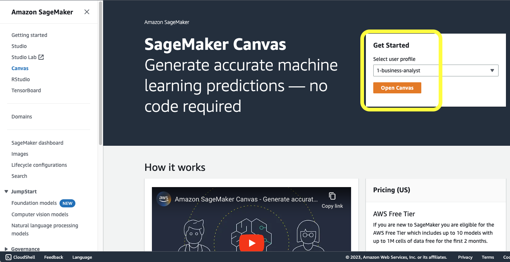
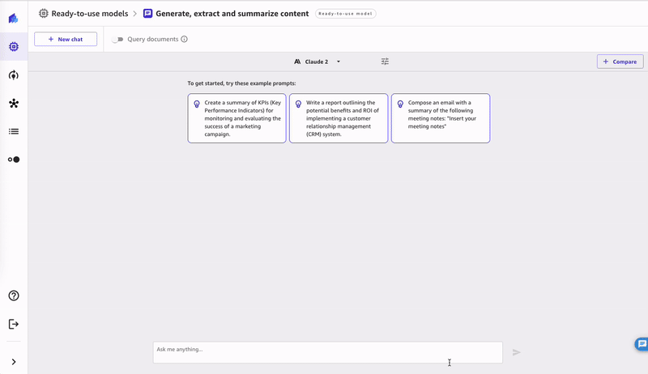
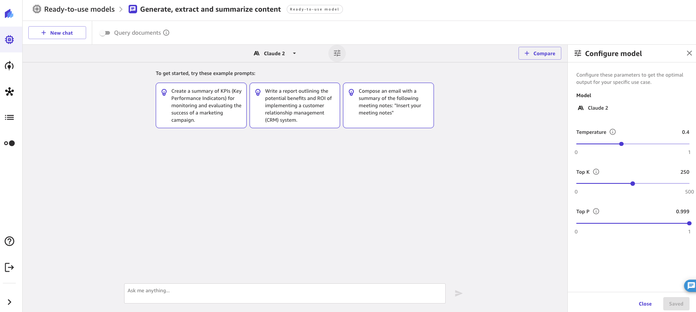
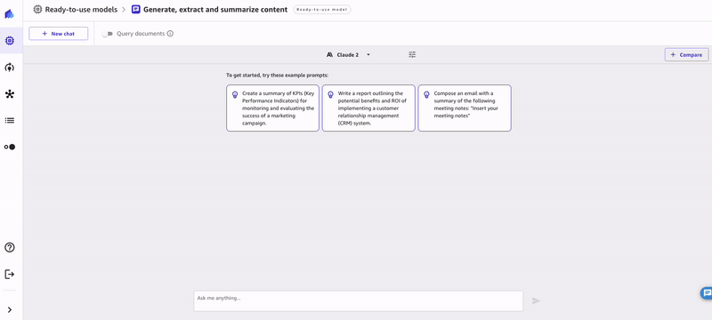
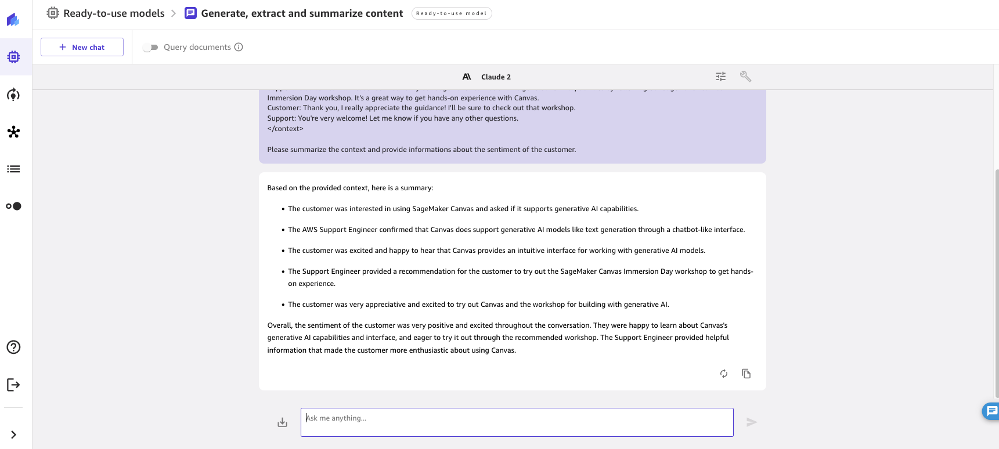
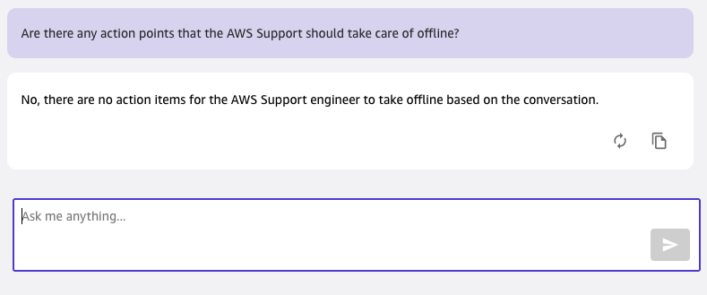
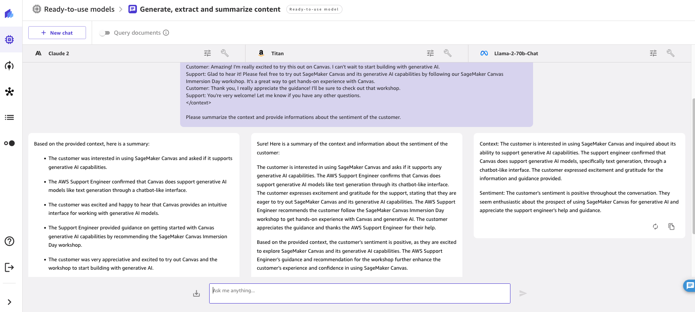

# Lab 1 - SageMaker Canvas for Generative AI

In this lab, we will see how to use Amazon SageMaker Canvas to explore and use state-of-the-art Foundation Models from Amazon Bedrock and Amazon SageMaker JumpStart, without writing a single line of code.

## Agenda

1. [What is Amazon SageMaker Canvas?](#what-is-amazon-sagemaker-canvas)
2. [SageMaker Canvas Chat Experience](#sagemaker-canvas-chat-experience)
3. [Use case: Contact Center Intelligence](#use-case-contact-center-intelligence)

## What is Amazon SageMaker Canvas?

Amazon SageMaker Canvas is a no-code Machine Learning (ML) service that allows everyone to use and create machine learning models without requiring machine learning expertise or coding skills. You can use SageMaker Canvas to:

- access state-of-the-art Generative AI models in a chatbot-like UX (powered by Amazon Bedrock and Amazon SageMaker JumpStart)
- use ready-to-use ML models to solve common tasks across Computer Vision, Natural Language Processing and Document Intelligence
- prepare your datasets for Machine Learning with repeatable data flows
- build your own ML models and collaborate with data scientists
- generate accurate predictions on your ML models or models that have been shared with you, either manually or on a schedule

## SageMaker Canvas Chat Experience


SageMaker Canvas chatbot experience allows users to leverage foundation models from Amazon Bedrock and Amazon SageMaker JumpStart in a chatbot UX, without the need to know about Generative AI, APIs, endpoints, tokens, parameters, chat interfaces, etc. The chat interface is pre-built in the SageMaker Canvas app users are already familiar with, in the ready-to-use models tab.

Once launched SageMaker Canvas chatbot experience, users can start interacting with foundation models with the chat interface, asking questions and providing prompts. Users can choose which model they want to interact with, from either Amazon Bedrock (Amazon and partners' models) or Amazon SageMaker JumpStart (open-source models). Users can also compare multiple models at once, to select whichever fits better the style of answers they're looking for.

### Access Amazon SageMaker Canvas

In order to access the Amazon SageMaker Canvas chatbot experience, start by accessing Amazon SageMaker Canvas. You can do so by clicking on this [link to the AWS Management Console](https://catalog.workshops.aws/canvas-immersion-day/en-US/3-genai/1-canvas-chat-features/console.aws.amazon.com/sagemaker/home/canvas-landing/) and click on Open Canvas after having selected the right domain and user profile.



If the application wasn't running before, you will see a loading screen like the following:


You can also access SageMaker Canvas directly from SageMaker Studio:


Once you're in the SageMaker Canvas app, you will see a purple banner if this is your first time on Amazon SageMaker Canvas. From there, you can click the "Get started now" button. If the banner is not available in your SageMaker Canvas app, you can access Canvas chatbot experience from the list of ready-to-use models under "**Generate, extract and summarize content**".

### Overview of the Canvas chat experience


SageMaker Canvas chatbot experiencehas four main components in the main app:

1. the model selector
1. the chat context
1. the user input
1. the index selector and "Query documents" toggle

As a user, you can provide a question in the input box, and SageMaker Canvas will take care of formatting it in the right way to interact with the model chosen in the model selector. The context of the conversation is kept in the UI and it is used throughout the conversation - meaning that Canvas will be able to refer to previous portions of the conversation to reply to your questions and therefore answer contextually.

SageMaker Canvas also provides some example prompts which can be useful to see how you can use the chat experience. For this demo, we'll click on the first suggested prompt and send it to the default model, Anthropic Claude V2 running on Amazon Bedrock.

### Available Models

SageMaker Canvas supports 9 foundation models from Amazon Bedrock and 13 open-source models from Amazon SageMaker JumpStart:


With respect to pricing, Amazon SageMaker Canvas **does not charge any extra** on top of the services being queried behind the scenes, and the hourly pricing for the Canvas app itself. It is important to note that Amazon Bedrock models are priced by the token, and do not require deployment on an endpoint. SageMaker Canvas open-source models are powered by Amazon SageMaker JumpStart - this means that, in order to use models, you will have to deploy them to an Amazon SageMaker endpoint. Amazon SageMaker Canvas takes care of automatically shutting down the endpoints after two hours of inactivity, however this requires the SageMaker Canvas app to be running.

For the rest of this lab, we will be using the **Anthropic Claude 2** model. It should be selected by default in the model selector. However, all of the labs can be run with any of the models available, but results may vary.



### Your first chat


Chatting with SageMaker Canvas and the models behind the scenes is as easy as typing your question in the input box at the bottom of the screen, and send it! Canvas will forward the query to the Foundation Model and stream back the answer in the UI.

SageMaker Canvas also allows you to control LLM inference parameters like temperature, top k or top P. To do so, just click on the setting icon right next to the model selector. 



### Comparing Models

One of the most powerful capabilities of SageMaker Canvas is the capability to compare multiple models at once, so that a user can choose the model that works best for their use case. To do so, it is sufficient to select the "**+ Compare**" button at the top right of the screen, select a new model to compare against, and ask the question. SageMaker Canvas will take care of generating the right prompt for each model, and return the answer from each of those, side by side for easy comparison. Currently, you can compare up to three different models at once.

1. Start a **New Chat** by clicking on the button at the top left of the screen
1. Then, click the **Compare** button at the top right of the screen
1. From this view, you will see a new **model selector**, where you can choose the model to compare against. Choose **Llama-2-70b-Chat**.
1. Send your query, and see the results in parallel!

Each of the answers can be re-generated or copied individually of course.



## Use case: Contact Center Intelligence

Let's take a look at how Amazon Sagemaker Canvas chatbot experience powered by Generative AI can help a contact center agent in reviewing existing interactions to bring insights that are hard to get from traditional tools. To do so, we have come up with a simulated conversation between an AWS customer and AWS Support. The AWS customers asks questions about SageMaker Canvas, and then reacts positively to the comments of AWS Support. The conversation is the following:

```
Customer: Hi there! I'm interested in using SageMaker Canvas and was wondering if it supports any generative AI capabilities?
Support: Hello! Yes, SageMaker Canvas does support generative AI models like text generation through its chatbot-like interface.
Customer: Oh great, that's awesome to hear! What kind of interface does Canvas provide for working with generative AI?
Support: The interface is chatbot-like, so you can have natural conversations with the generative AI models to get generated text responses. It makes it very intuitive to work with models like text generation.
Customer: Amazing! I'm really excited to try this out on Canvas. I can't wait to start building with generative AI.
Support: Glad to hear it! Please feel free to try out SageMaker Canvas and its generative AI capabilities by following our SageMaker Canvas Immersion Day workshop. It's a great way to get hands-on experience with Canvas.
Customer: Thank you, I really appreciate the guidance! I'll be sure to check out that workshop.
Support: You're very welcome! Let me know if you have any other questions.
```

### Basic information about prompt engineering

In order to use models at their fullest, it is a good practice to learn how to write good prompts that the model can interpret correctly and understand how to extract information. This is called prompt engineering. Usually a prompt is composed of a combination of any of these parts:

- Instruction - a specific task or instruction you want the model to perform
- Context - external information or additional context that can steer the model to better responses
- Input Data - the input or question that we are interested to find a response for
- Output Indicator - the type or format of the output.

In our case, we want the bot to help us make sense of the Support conversation. So, we instruct the model to know that we are requiring it to make sense of a customer conversation, we provide the conversation as context, and finally we give our question and goal as input. Additionally, we delimit the context with tags to simplify the task of identifying the conversation for the bot - this is not strictly required but it is a good practice. The final prompt will look like the following:

```
Here is a conversation between an AWS Support Engineer and an AWS customer. You understand the conversation delimited by <context> tags and you provide answers based on this context. 

<context>
Customer: Hi there! I'm interested in using SageMaker Canvas and was wondering if it supports any generative AI capabilities?
Support: Hello! Yes, SageMaker Canvas does support generative AI models like text generation through its chatbot-like interface.
Customer: Oh great, that's awesome to hear! What kind of interface does Canvas provide for working with generative AI?
Support: The interface is chatbot-like, so you can have natural conversations with the generative AI models to get generated text responses. It makes it very intuitive to work with models like text generation.
Customer: Amazing! I'm really excited to try this out on Canvas. I can't wait to start building with generative AI.
Support: Glad to hear it! Please feel free to try out SageMaker Canvas and its generative AI capabilities by following our SageMaker Canvas Immersion Day workshop. It's a great way to get hands-on experience with Canvas.
Customer: Thank you, I really appreciate the guidance! I'll be sure to check out that workshop.
Support: You're very welcome! Let me know if you have any other questions.
</context>

Please summarize the context and provide informations about the sentiment of the customer.
```

### Sending the prompt to the model

Copy the text above and send it to the model of your choice. You should now get an answer similar to the following one:



The model correctly detects that the customer asked about SageMaker Canvas Generative AI capabilities, and is happy about the answers provided. Let's try to ask if the AWS Support has any actions to take after the session:



As you can see, no actions are required from the AWS Support Engineer at the end of this conversation. Note that we didn't have to reformulate the context and instruction again, since this is kept in the "memory" buffer of the SageMaker Canvas app. Try to ask additional questions to the bot based on this context. For example: 

1. Write a follow-up email that the AWS Support should send to the customer to recap the conversation 
2. Write a one-line report about the conversation 
3. What are the AWS Support recommendation to the customer in order to get started? 
4. What is Amazon SageMaker Canvas?

You can try and send the initial prompts and the follow-up questions to multiple models at once, to see how they behave. SageMaker Canvas allows the capability to compare multiple models, by simply clicking the Compare button on the top right of your screen.

