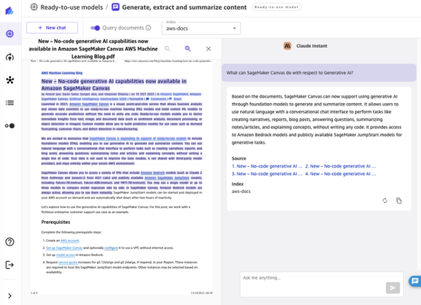
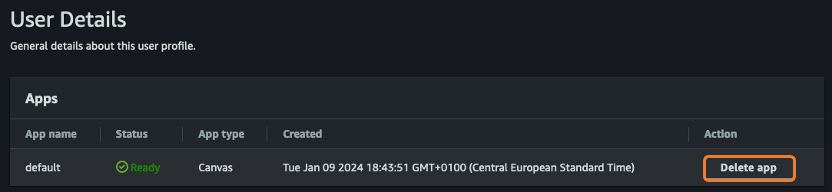
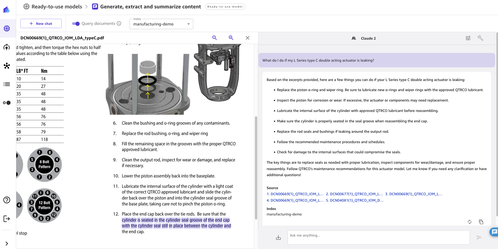
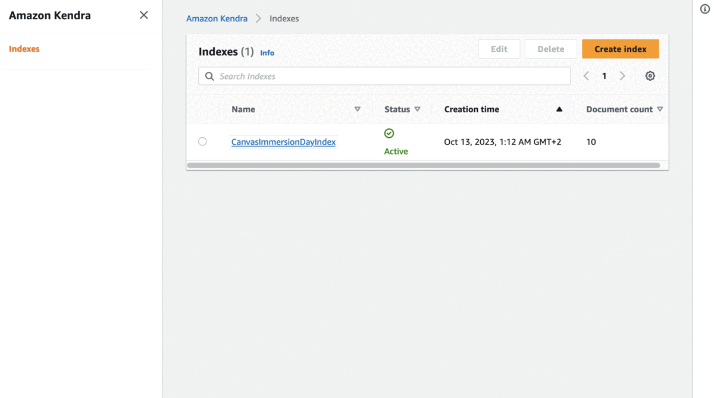

# Lab 2 - No-Code Enterprise Search (Retrieval Augmented Generation) with Amazon SageMaker Canvas

SageMaker Canvas lets users ask questions or have conversations and get responses that are grounded in their enterprise’s data. Ensuring the results they get back are specific to their context and not some generic replies. This release makes it possible to connect Canvas directly to your existing knowledge-bases or upload new knowledge as/when required and be able to perform conversation-AI in a friction-less manner. A cloud administrator can configure [Amazon Kendra](https://aws.amazon.com/kendra/) indexes as data sources for SageMaker Canvas users, while SageMaker Canvas takes care of building the connection to Amazon Kendra, providing intuitive controls over chat experiences and without a single line of code. Canvas users can ideate, research and explore knowing that the output will always be backed by their sources-of-truth.



As part of this lab, we will wear the shoes of an operator of a large oil & gas company. We'll be searching through a large set of instruction and maintenance manuals for actuators, which are highly-precise components used to control valve pressures and remotely open and close valves in pipelines. These technical manuals serve as a good example of querying and gathering insights from specialized enterprise data and documents.

**Note:** to run this lab, you will need to create an Amazon Kendra index. Make sure to have all the right permissions to do so, then review and understand [Amazon Kendra pricing](https://aws.amazon.com/kendra/pricing) before proceeding. Running this lab is free for the first month, leading in additional charges after it. The sync operation will cost less than $1 in total. 

## Creating the Amazon Kendra Index

1. Download the dataset from [here](https://static.us-east-1.prod.workshops.aws/public/b74dd72c-ad18-450e-bbbf-ae673a9e6c58/assets/datasets/industrial-documents.zip) and unzip it in your PC
1. Upload all PDFs to an **Amazon S3** bucket of your choice. If possible, create a new Amazon S3 bucket, and upload all the files in a single folder
1. Create the Amazon Kendra index. To do so, search for Amazon Kendra in the AWS Management Console, then click **Create index**
    1. Provide an index name `canvas-immday`, then create a new IAM role, then click **Next**;
    1. Leave the settings to default for Access Control Settings (No) and User-group expansion (None), then click **Next**;
    1. For provisioning editions, select **Developer edition** (covered by Free Tier), then click **Next**;
    1. Proceed to **Create**;
    1. Creating the index can take up to 30 minutes.
1. Once the index is created, **add a data source**, selecting the bucket where you uploaded the dataset previously. If you've selected an existing bucket, provide the path where your data is stored
1. Once you've configured the data source, click on the button **Sync now** at the top right of your screen. This will start the indexing process of your data.


## Configuring SageMaker Canvas

In order to give SageMaker Canvas access to the Kendra index we have just created, we need to update some configuration parameters.

1. Search **Amazon SageMaker** in the AWS Management Console, then select **Domains** on the left, then select the domain you want to use
1. In the user profile list, select your user, then click **Edit** at the bottom right of the screen
1. On the left-hand menu, click on **Step 4 - Canvas settings**, then scroll down to **Canvas Ready-to-use models configuration**
1. Here, make sure that **Enable document query using Amazon Kendra** is enabled, then in the dropdown below select `canvas-immday` as index, or select the name you chose previously
1. Scroll down and click on **Submit**


To make sure the changes are propagated, click on **Delete app** before opening again SageMaker Canvas.



## Querying your documents

First of all, access the chatbot experience from the SageMaker Canvas ready-to-use models tab.


Once there, select the model(s) that you want to use for this experiment. We will start with **Anthropic Claude 2**. To query your Amazon Kendra index, make sure that the **toggle "Query documents" is activated**, and select the index among the list of available indices.

Once the index is selected, you can go ahead and start asking questions. Here is an example query:

> What do I do if my L Series type C double acting actuator is leaking?

For the questions asked, the chat will show the answer generated by the foundation model, along with the source documents that contributed to generating the answer. When clicking any of the source documents, SageMaker Canvas opens a preview of the document, highlighting the excerpt used by the foundation model.



Of course, it is possible to compare the answers generated by different models against the same query. Each of them will provide answers generated by the model, and the sources associated to the answer generated:


Here is a list of other questions you can try with the "Query documents" toggle on. We also suggest giving a try and asking the same questions without the toggle enabled, to see how the hallucinated/confabulated answer differs from the factual answer generated from the knowledge base. Copy them one by one and test them against one or more models.

```
What continuous immersion ratings are F2-Series actuators capable of achieving?
What is the maximum torque resistance that the F2 actuator Size 2200 can overcome without experiencing increased wear and early failure?
Where do I find the travel adjustment for Q-Series and F-series quarter turn actuators?
Summarize the piston and end cap seal replacement for the Q-Series And F-Series Quarter Turn Actuators?
What are the key steps in installing the APCI.056 retainer plate for a Q2 series actuator?
How do I replace the yoke seal and bushing for a D Series Double Acting Actuator? 
```

## (Optional) What if I wanted to use my own documents?

Now that you have tested querying the documents provided above (pre-deployed in event environments provided by AWS, AKA Workshop Studio), maybe you want to be able to upload your own documents and query them. In order to do so, you will have to go through the following steps:

1. Go to Amazon S3, identify the bucket used by Amazon Kendra, and upload your PDFs
1. Go to Amazon Kendra, then:
    1. Identify the index you want to use, in our case CanvasImmersionDayIndex
    1. Go to the Data Sources and find the one already set-up, and click on the Sync button
    1. Wait for the sync to be complete
1. Go back to Amazon SageMaker Canvas, and start querying your new documents

